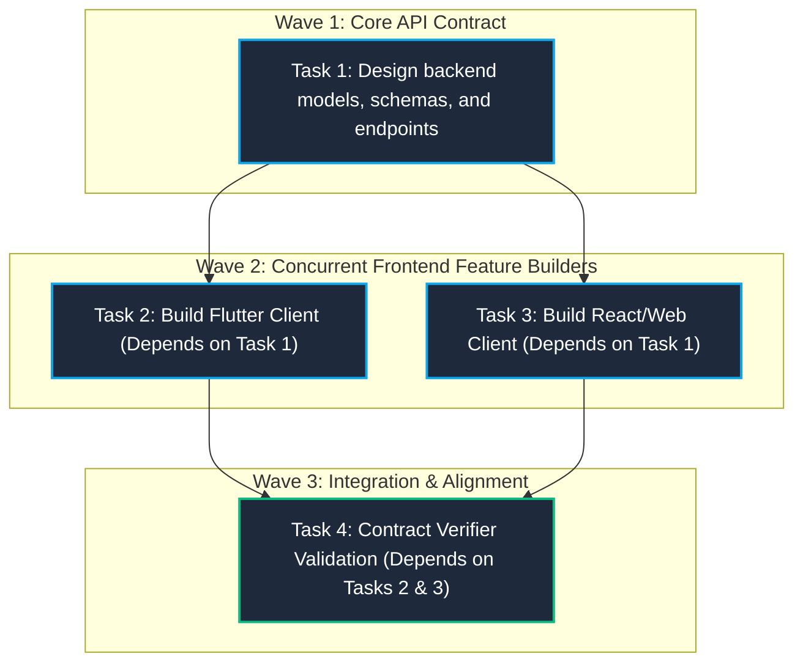
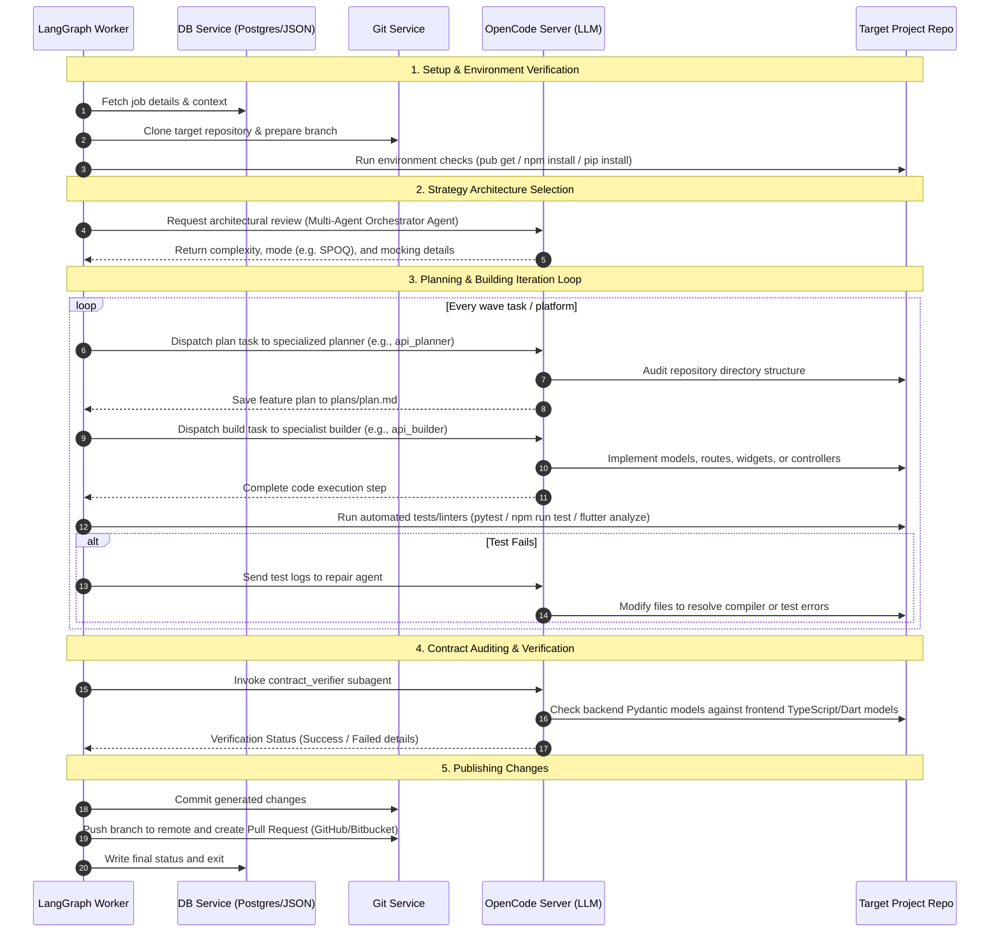

# Multi-Agent Platform & Orchestration Architecture

This document provides a comprehensive view of the system architecture of the **ebprocess-development** project. It outlines how the stateful pipeline coordinates multiple specialist agents to execute complex, multi-platform development tasks using LangGraph and **SPOQ (Specialist Orchestrated Queuing)**.

---

## 1. High-Level System Architecture

The core of `ebprocess-development` is a stateful orchestration graph built on top of **LangGraph**. The pipeline coordinates repository setup, ticket analysis, specialist planning, source code generation, automated verification (linters/tests), contract checking, and publishing.

### LangGraph Stateful Pipeline

The workflow starts in the `prepare` node and dynamically routes through planning, generation, validation, contract verification, and error repair before publishing changes:


---

## 2. Orchestration Strategies & Execution Modes

The `orchestrate` node is responsible for parsing input ticket properties (summary, description, and acceptance criteria) and active platforms (API, Flutter, Web, CMS) to choose the optimal `OrchestrationStrategy`. 

### The Decision Maker
1. **LLM Evaluation**: A session is created with the `multi_agent_orchestrator` agent on the OpenCode server to parse details and return an evaluation schema.
2. **Rule-Based Heuristic Fallback**: If the LLM call fails, the node falls back to regex-based classification:
   - **Offline-First Detection**: Scans for keywords like `offline`, `local storage`, `sqlite`, `hive`, `drift`, or `cache`.
   - **UI/UX-Only Detection**: Scans for presentation keywords (`style`, `screen`, `widget`, `padding`) and verifies they contain no backend elements (`api`, `db`, `migration`).

### Core Execution Modes
* **Sequential**: Executes task planning, generation, and validation for each platform one after another.
* **Parallel**: Runs tasks across all requested platforms concurrently (suitable for low-complexity or UI-only edits).
* **SPOQ (Specialist Orchestrated Queuing)**: A wave-based topological dependency dispatch system for complex, multi-platform epics.

---

## 3. Specialist Orchestrated Queuing (SPOQ)

SPOQ organizes multi-platform epics by breaking them down into a Direct Acyclic Graph (DAG) of task files (e.g. `.yml` format). Tasks are dispatched in **waves** based on completed dependencies.

For example, when building a feature that requires both database, backend API, and mobile/web frontends:



* **Dependency Resolution**: In each pass through the `validate` loop, if execution mode is `spoq`, `get_active_wave_tasks` scans the SPOQ epic task directory and extracts tasks that are `pending` or `blocked` but have all their listed `dependencies` marked as `completed`.
* **State Advancement**: The graph routes back to `plan` and `generate` to execute these tasks. Once all tasks are complete, the pipeline advances to systemic `contract` verifications.

---

## 4. Specialist Agent Profiles

The system interacts with a pool of headless agent profiles defined in `.opencode/agents/`. Each agent possesses dedicated system prompts and allowed tools:

| Agent Profile | Mode | Target Platform / Layer | Primary Focus |
|:---|:---|:---|:---|
| **api_planner** | Primary | API (FastAPI / NestJS) | Audits existing models/modules and writes the execution plan (`plan.md`). |
| **api_builder** | Primary | API (FastAPI / NestJS) | Implements schemas, repositories, resolvers, controllers, and tests. |
| **flutter_planner** | Primary | Flutter / Dart Mobile | Reviews widget trees and state schemas, outlines mobile screen layouts. |
| **flutter_builder** | Primary | Flutter / Dart Mobile | Generates Dart widgets, models, controllers, and runs `build_runner` tasks. |
| **web_planner** | Primary | React / Next.js Web | Plans components, state hooks, and routing hooks for the web framework. |
| **web_builder** | Primary | React / Next.js Web | Scaffolds and writes TypeScript files, pages, styles, and web integration tests. |
| **contract_verifier**| Subagent| Cross-Platform | Compares Pydantic schemas/routes against TypeScript models and Dart classes. |
| **figma_assets** | Subagent| Design Assets | Extracts visual styles and outputs scaffolding assets based on Figma URLs. |

---

## 5. End-to-End Pipeline Execution Lifecycle



---

## 6. Project Codebase Layout

```
.
├── docker-compose.yml              # Multi-container local execution setup
├── pyproject.toml                  # Python package configuration (Poetry/Pyright)
├── src
│   └── ebdev
│       ├── config.py               # Environmental configuration loader
│       ├── core
│       │   ├── constants.py        # System constants and regex patterns
│       │   ├── exceptions.py       # Decoupled custom exceptions (GitServiceError, etc.)
│       │   ├── graph.py            # LangGraph StateGraph pipeline routing logic
│       │   ├── nodes/              # Pipeline node steps (prepare, plan, validate, etc.)
│       │   └── spoq_utils.py       # SPOQ task parsing and wave resolution helpers
│       ├── models
│       │   └── schemas.py          # Decoupled schemas and GraphState definition
│       └── services
│           ├── db.py               # DB tracking and local JSON fallback engine
│           ├── flutter_cmd.py      # Headless Flutter CLI executor
│           ├── git.py              # Git repository and branch provider
│           ├── opencode.py         # SSE-streaming client connection to OpenCode
│           ├── prompts.py          # Prompt generators for active nodes
│           └── starter.py          # Starter skeleton seed coordination
```
