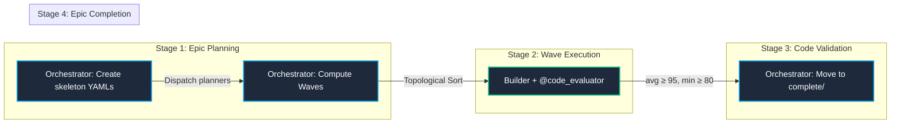
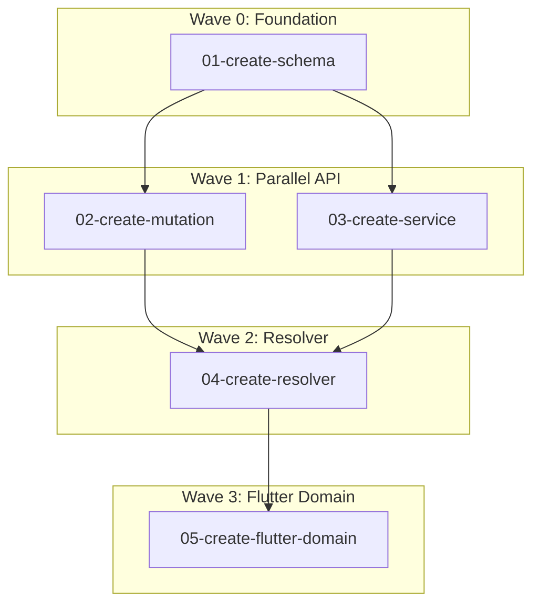
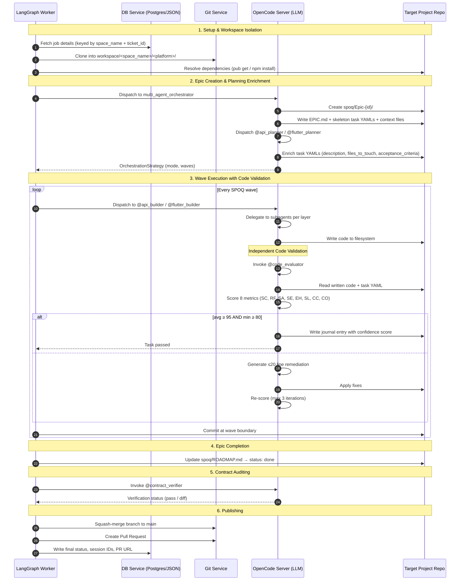

# Multi-Agent Platform & Orchestration Architecture

This document provides a comprehensive view of the **ebprocess-development** system. It describes how the stateful pipeline coordinates multiple specialist agents to execute complex, multi-project, multi-platform development tasks using LangGraph, OpenCode, and **SPOQ (Specialist Orchestrated Queuing)** (arXiv:2606.03115v1).

---

## 1. High-Level System Architecture

The core of `ebprocess-development` is a **stateful orchestration graph** built on **LangGraph**. The pipeline coordinates epic creation, task decomposition, wave-based dispatch, source code generation, code validation (8-metric scoring), contract verification, and publishing.

Multiple independent projects run **concurrently** because all per-project state — epics, tasks, journals — is **isolated by `space_name`** inside the `spoq/` directory.

### LangGraph Stateful Pipeline


Each `generate_node` invocation dispatches a builder agent, which writes code then invokes the **`@code_evaluator`** — an independent reviewer that scores the output against 8 quality metrics before marking the task complete.

---

## 2. Multi-Project Workspace Isolation

Each project is identified by a **`space_name`** (e.g. `"ebsprinter"`, `"ebprocess"`). All pipeline nodes resolve storage paths through `JobContext.project_storage_dir()`, ensuring **zero cross-project collisions**.

### Directory Layout

```text
workspace/                               ← runtime project checkouts
└── {space_name}/                        ← e.g. ebmobileapp
    ├── spoq/                            ← SPOQ root
    │   ├── ROADMAP.md                   ← Cross-epic registry
    │   ├── Epic-{id}/                   ← e.g. Epic-44445
    │   │   ├── EPIC.md                  ← Goal, architecture, DAG, wave assignments
    │   │   ├── {task-name}.yml          ← Task YAML (named by ticket name)
    │   │   ├── context_api.json         ← Platform context (generated)
    │   │   ├── context_flutter.json     ← Platform context (generated)
    │   │   └── journals/                ← Agent session journals
    │   │       ├── 2026-07-05_development_builder.md
    │   │       └── JOURNAL.md           ← Consolidated
    │   └── Epic-{id}/                   ← Multiple epics can coexist
    │       └── ...
    │
    ├── .ebpearls/                       ← Legacy task storage (migrating to spoq/)
    │   └── ...
    │
    ├── {space_name}-services/           ← API platform (NestJS)
    └── {space_name}_flutter/            ← Flutter platform

.opencode/                               ← Agent state and profiles (gitignored)
├── agents/                              ← Agent instruction files
│   ├── multi_agent_orchestrator.md
│   ├── code_evaluator.md                ← Independent reviewer
│   ├── api_builder.md / flutter_builder.md
│   └── ...
├── skills/                              ← Reusable skill definitions
│   ├── agent-validation/SKILL.md        ← 8-metric code validation rubric
│   ├── journal-tracker/SKILL.md         ← Session journal format
│   └── ...
├── sessions.json
└── jobs.json
```

### Isolation Rule

`JobContext.project_storage_dir()` resolves to `<workspace_dir>/<space_name>/.ebpearls/`. All SPOQ data uses paths relative to the workspace project root. No two projects share state.

---

## 3. Orchestration Strategies & Execution Modes

The `orchestrate_node` parses ticket properties to choose an `OrchestrationStrategy`.

### Decision Process

1. **LLM Evaluation**: Dispatches to `multi_agent_orchestrator` agent to evaluate complexity and return a structured `OrchestrationStrategy` schema.
2. **Rule-Based Heuristic Fallback**: If the LLM call fails, applies regex keyword classification:
   - **Offline-First Detection**: Scans for `offline`, `local storage`, `sqlite`, `hive`, `drift`, `isar`, `cache`.
   - **UI/UX-Only Detection**: Presentation keywords (`style`, `screen`, `widget`) with no backend elements (`api`, `db`, `migration`).

### `OrchestrationStrategy` Schema

| Field | Values | Description |
|:---|:---|:---|
| `complexity` | `low` / `medium` / `high` | Ticket complexity rating |
| `execution_mode` | `spoq` / `parallel` / `sequential` | Pipeline execution mode |
| `mocking_level` | `live` / `mock_repositories` / `ui_stubs` | Frontend mocking strategy |
| `offline_first` | `bool` | Enable offline-first architecture |
| `ui_ux_only` | `bool` | Skip backend if pure UI ticket |
| `max_repair_iterations` | `int` | Repair loop budget (default: 3) |
| `stages` | `List[List[str]]` | Platform execution waves (sequential/parallel mode) |

### Core Execution Modes

| Mode | Description |
|:---|:---|
| **Sequential** | Platforms execute one after another (wave-based `stages` list) |
| **Parallel** | All platforms run concurrently with `asyncio.gather` |
| **SPOQ** | Wave-based DAG dispatch with topological sort, code validation gate, and epic lifecycle |

---

## 4. Specialist Orchestrated Queuing (SPOQ)

SPOQ is a published methodology (arXiv:2606.03115v1) for multi-agent software engineering. It combines wave-based topological dispatch, dual validation gates, and human-as-agent integration. Our implementation adopts the four-stage pipeline, 8-code-metric validation gate, journal tracking with confidence scores, and epic lifecycle management.

### Four-Stage Pipeline



### Epic Directory Structure

Each epic occupies its own directory under `spoq/`:

```
spoq/
  ROADMAP.md                    ← Centralized epic registry (status: planned → in-progress → done)
  Epic-{id}/                    ← e.g. Epic-44445 (one directory per epic)
    EPIC.md                     ← Goal, architecture, dependency DAG, wave assignments
    {task-name}.yml             ← Task YAML (named by ticket name, e.g. contract-41831.yml)
    context_api.json            ← Platform context (generated by orchestrator)
    context_flutter.json
    journals/                   ← Agent session journals
```

### Task YAML Schema

Each task file follows a standardized schema (SPOQ Definition 5.1) with three field categories:

**Identity Fields:**
```yaml
id: 01-create-schema
title: Create Enquiry Mongo Schema
epic: example-enquiry
```

**Execution Control Fields:**
```yaml
status: pending              # pending | in_progress | completed | blocked
priority: high
phase: 0                     # Wave assignment (0 = no dependencies)
estimate:                    # PERT three-point estimate
  optimistic: 30m
  realistic: 1h
  pessimistic: 2h
dependencies: []             # Task IDs that must complete first
skills_required:
  - api-schema
  - mongoose
```

**Deliverable & Verification Fields:**
```yaml
files_to_touch:
  - libs/data-access/src/enquiry/enquiry.schema.ts
outputs:
  - "Enquiry Mongoose schema with timestamps"
acceptance_criteria:
  - "[ ] TypeScript compiles without errors"
  - "[ ] Schema has all required fields"
description: |
  ## Objective
  Create the Enquiry MongoDB schema.
  ## Steps
  1. Create schema file...
```

### Wave-Based Topological Dispatch

Wave assignment is computed via topological sort (Kahn's algorithm). Tasks in the same phase have no dependencies on each other and execute concurrently.



### Code Validation Gate (8 Metrics)

After each task is implemented, the `@code_evaluator` agent independently scores the output against 8 metrics:

| # | Metric | What It Checks | Platform-Specific |
|---|--------|---------------|-------------------|
| 1 | **SC** — Syntactic Correctness | Compiles without errors? | `tsc --noEmit` / `flutter analyze` |
| 2 | **RF** — Requirements Fidelity | Matches task `acceptance_criteria`? | Compare code to YAML spec |
| 3 | **SA** — SOLID Adherence | Follows SOLID principles? | NestJS module pattern / Clean Architecture |
| 4 | **SE** — Security | OWASP Top 10 free? | Guards, validation, no injection |
| 5 | **EH** — Error Handling | Failures handled gracefully? | `@Catch()` / `handleAPICall` |
| 6 | **SL** — Scalability | Hot-path complexity? | Pagination, indexes, `ListView.builder` |
| 7 | **CC** — Code Clarity | Readable and self-documenting? | Project convention conformance |
| 8 | **CO** — Completeness | No TODOs/stubs? | No `FIXME`, no placeholders |

**Pass criteria:** `avg(M₁…M₈) ≥ 95 AND min(M₁…M₈) ≥ 80`

On failure: evaluator returns **≤20 line remediation** with `file:line` references and numbered action items. Builder applies fixes and re-submits (max 3 iterations).

### Journal Tracking with Confidence Scoring

Each agent session writes a journal entry with YAML frontmatter and structured Markdown body:

```yaml
---
agent: Claude Code (Opus 4.5)
start_time: 2026-07-05T10:00:00Z
end_time: 2026-07-05T11:30:00Z
confidence: 0.88
session_type: development
files_modified:
  - libs/data-access/src/enquiry/enquiry.schema.ts
tasks_completed: 1
tasks_total: 3
---
```

Confidence calibration: ≥0.95 production-ready, 0.85–0.94 well tested, 0.75–0.84 functional, 0.65–0.74 needs validation, <0.65 experimental.

### Epic Lifecycle

1. **Creation:** Orchestrator creates skeleton task YAMLs + EPIC.md → dispatches planners to enrich YAMLs with description, files_to_touch, acceptance_criteria → `spoq/Epic-{id}/`
2. **Execution:** Orchestrator computes waves, dispatches builders, invokes evaluator per task. ROADMAP.md → `in-progress`
3. **Validation:** Each task scored against 8 metrics; failed tasks enter remediation loop
4. **Completion:** All tasks passed → ROADMAP.md → `done`. No filesystem move needed.
5. **Commit:** Branch-per-epic with squash-merge to main. Commits at wave boundaries.

---

## 5. Specialist Agent Pool

All agent profiles live in `.opencode/agents/`. Primary agents are invoked directly by pipeline nodes. Subagents are delegated via `@agent-name` syntax.

### Primary Agents

| Agent | Platform | Responsibility |
|:---|:---|:---|
| `multi_agent_orchestrator` | Cross-Platform | Creates epics, computes waves, dispatches builders, manages lifecycle |
| `code_evaluator` | Cross-Platform | Independent 8-metric code reviewer (read-only) |
| `api_planner` | API (NestJS) | Audits modules, enriches task YAML description/files_to_touch/acceptance_criteria |
| `api_builder` | API (NestJS) | Implements schemas, DTOs, services, resolvers, modules |
| `flutter_planner` | Flutter | Reviews widget trees, enriches task YAML description/files_to_touch/acceptance_criteria |
| `flutter_builder` | Flutter | Generates domain/data/state/UI layers |
| `web_planner` | React/Next.js | Plans components and routing |
| `web_builder` | React/Next.js | Scaffolds pages and styles |
| `api_bug_fixer` | API | Diagnoses and patches backend failures |
| `flutter_bug_fixer` | Flutter | Diagnoses and patches Flutter failures |

### Subagents (Delegated via `@`)

| Subagent | Delegated From | Responsibility |
|:---|:---|:---|
| `@api_schema_builder` | `api_builder` | Mongoose schemas, BaseRepo repos |
| `@api_dto_generator` | `api_builder` | GraphQL InputType/ObjectType, validation |
| `@api_service_builder` | `api_builder` | Business logic, @Transactional(), i18n |
| `@api_route_builder` | `api_builder` | GraphQL resolvers, REST controllers, guards |
| `@api_module_integrator` | `api_builder` | Module wiring, mongoose-models.ts + providers.ts |
| `@api_linter` | `api_builder` | ESLint + Prettier on changed files |
| `@api_localization` | `api_builder` | i18n JSON catalog management |
| `@api_contract_verifier` | `contract_node` | Cross-platform GraphQL contract checks |
| `@flutter_domain` | `flutter_builder` | Domain models + abstract repository interfaces |
| `@flutter_graphql` | `flutter_builder` | .graphql operation files, schema refresh |
| `@flutter_data` | `flutter_builder` | Freezed models, data sources, repo impls |
| `@flutter_state` | `flutter_builder` | SimplexCubit + freezed state |
| `@flutter_ui` | `flutter_builder` | Pages and widgets, Bloc wiring |
| `@flutter_ui_refiner` | `flutter_builder` | Visual polish, spacing, tokens |
| `@flutter_design_system` | `flutter_builder` | Token/spacing review |
| `@flutter_localization` | `flutter_builder` | ARB file management |
| `@flutter_linter` | `flutter_builder` | `flutter analyze`, targeted fixes |
| `@flutter_figma_assets` | `flutter_planner` | Figma design token extraction |

### Delegation Patterns

```
api_builder → @api_schema_builder → @api_dto_generator → @api_service_builder
           → @api_route_builder → @api_module_integrator → @api_linter
           → @code_evaluator (after each task)

flutter_builder → @flutter_domain → @flutter_graphql → @flutter_data
               → @flutter_state → @flutter_ui → @flutter_ui_refiner
               → @flutter_design_system → @flutter_localization → @flutter_linter
               → @code_evaluator (after each task)
```

### Skill Framework

Reusable capabilities live in `.opencode/skills/`:

| Skill | Purpose |
|:---|:---|
| `agent-validation` | 8-metric code scoring rubric (SC, RF, SA, SE, EH, SL, CC, CO) |
| `journal-tracker` | Session journal format with confidence calibration |
| `api-scaffolder` | NestJS module, service, resolver patterns |
| `nestjs-graphql-resolvers` | Code-first GraphQL types and resolvers |
| `nestjs-i18n-localization` | Translation key management |
| `feature-scaffolder` | Flutter Clean Architecture directory scaffolding |
| `api-integration` | Freezed models, GraphQL sources, repos |
| `state-management` | SimplexCubit, FormMixin, handleAPICall |
| `ui-generator` | Flutter page and widget generation |
| `design-system` | Token migration, responsive sizing |
| `localization` | ARB extraction and l10n refactoring |
| `graphql-client-codegen` | Schema sync and Ferry codegen |
| `compiler-diagnostics-resolver` | TypeScript/Flutter error pattern matching |

---

## 6. End-to-End Pipeline Execution Lifecycle



---

## 7. Key Data Schemas

### `JobContext` — Pipeline Execution Context

| Field | Type | Description |
|:---|:---|:---|
| `task_id` | `str` | Unique task identifier |
| `space_name` | `str` | Project identifier — drives workspace and storage resolution |
| `ticket_id` | `str` | Ticket/epic identifier (e.g. `ENQ-5`) |
| `ticket` | `SprintTicket` | Full ticket data with nested EpicTask list |
| `repo_path` | `str` | Resolved host path: `workspace/<space_name>/` |
| `platforms` | `List[str]` | Active platforms: `api`, `flutter`, `web` |
| `spoq_epic_dir` | `Optional[str]` | Path to active SPOQ epic directory |
| `active_task_id` | `Optional[str]` | Current task within the epic |
| `starter_types` | `Dict[str, str]` | Per-platform scaffold: `{"api": "nestjs", "flutter": "flutter"}` |
| `mocking_level` | `str` | `live` / `mock_repositories` / `ui_stubs` |
| `offline_first` | `bool` | Enable offline-first patterns |

### `SprintTicket` — Epic / Ticket Model

| Field | Type | Description |
|:---|:---|:---|
| `id` | `str` | Ticket identifier |
| `title` | `str` | Human-readable title |
| `tasks` | `List[EpicTask]` | Nested tasks with per-platform hour estimates |

### `EpicTask` — Task Within an Epic

| Field | Type | Description |
|:---|:---|:---|
| `id` | `int` | Task identifier |
| `name` | `str` | Task name |
| `status` | `str` | `pending` / `in_progress` / `completed` |
| `hours` | `List[EpicTaskHour]` | Per-platform hour estimates |
| `active_platforms` | `List[str]` (property) | Platforms with > 0 estimated hours |

### `SPOQTask` — YAML Task Schema

| Field | Type | Description |
|:---|:---|:---|
| `id` | `str` | Unique task ID (e.g. `01-create-schema`) |
| `phase` | `int` | Wave assignment (0 = no dependencies) |
| `dependencies` | `List[str]` | Prerequisite task IDs |
| `skills_required` | `List[str]` | Required domain skills |
| `files_to_touch` | `List[str]` | Files the agent may modify |
| `acceptance_criteria` | `List[str]` | Verification checklist |

### `GraphState` — LangGraph Node State

| Field | Type | Description |
|:---|:---|:---|
| `context` | `JobContext` | Active job parameters |
| `strategy` | `OrchestrationStrategy` | Execution strategy from orchestrate node |
| `current_stage` | `int` | Current SPOQ/sequential wave index |
| `platform_results` | `Dict[str, JobResult]` | Per-platform build results |
| `done_platforms` | `Dict[str, bool]` | Validation pass status per platform |
| `opencode_session_ids` | `Dict[str, str]` | Resumable session IDs per platform |
| `is_spoq` | `bool` (property) | True when execution_mode is `"spoq"` |

---

## 8. Project Codebase Layout

```
.
├── Architecture.md                   ← This file
├── docker-compose.yml                ← Multi-container local execution setup
├── pyproject.toml                    ← Python package configuration (Poetry/Pyright)
├── .gitignore                        ← Excludes workspace/, .opencode/, .env
│
├── spoq/                             ← SPOQ reference template
│   ├── ROADMAP.md                    ← Cross-epic registry
│   └── Epic-44445/                   ← Sample epic template
│       ├── EPIC.md
│       ├── contract-41831.yml
│       ├── api-impl-41831.yml
│       ├── flutter-impl-41831.yml
│       ├── integration-41831.yml
│       └── journals/
│
├── workspace/                        ← (gitignored) Runtime project checkouts
│   └── <space_name>/
│       ├── spoq/epics/               ← Active epics created at runtime
│       └── <platform>/
│
├── .opencode/                        ← (gitignored) Agent state and profiles
│   ├── agents/                       ← 38 agent instruction files
│   │   ├── multi_agent_orchestrator.md
│   │   ├── code_evaluator.md         ← Independent 8-metric reviewer
│   │   ├── api_builder.md / flutter_builder.md
│   │   ├── api_planner.md / flutter_planner.md
│   │   ├── web_builder.md / web_planner.md
│   │   ├── api_schema_builder.md / api_dto_generator.md / ...
│   │   ├── flutter_domain.md / flutter_data.md / flutter_state.md / flutter_ui.md
│   │   ├── bug_fixer.md / ui_refiner.md
│   │   ├── contract_verifier.md / figma_assets.md
│   │   └── linter.md / design_system.md / localization.md / ...
│   ├── skills/                       ← 13 reusable skill definitions
│   │   ├── agent-validation/SKILL.md
│   │   ├── journal-tracker/SKILL.md
│   │   └── ...
│   ├── sessions.json
│   └── jobs.json
│
└── src/
    └── ebdev/
        ├── config.py                 ← Environment configuration loader
        ├── core/
        │   ├── exceptions.py         ← Domain exceptions
        │   ├── graph.py              ← LangGraph StateGraph pipeline & routing
        │   ├── nodes/
        │   │   ├── prepare.py        ← Workspace clone & dependency setup
        │   │   ├── orchestrate.py    ← Strategy selection & SPOQ DAG generation
        │   │   ├── plan.py           ← Concurrent planner invocation
        │   │   ├── generate.py       ← Concurrent builder invocation
        │   │   ├── validate.py       ← Platform linter/test runner
        │   │   ├── contract.py       ← Cross-platform schema verifier
        │   │   ├── repair.py         ← Failure analysis and repair
        │   │   ├── publish.py        ← Branch commit and PR creation
        │   │   └── finalize.py       ← Job status persistence
        │   └── spoq_utils.py         ← Wave computation, task loading, epic lifecycle
        ├── models/
        │   └── schemas.py            ← JobContext, GraphState, SPOQTask, EpicTask, ...
        ├── platforms/
        │   ├── base.py               ← PlatformStrategy abstract interface
        │   ├── flutter.py            ← FlutterStrategy
        │   └── api.py                ← ApiStrategy
        └── services/
            ├── db.py                 ← Job tracking & JSON fallback
            ├── flutter_cmd.py        ← Headless Flutter CLI executor
            ├── git.py                ← Git repository, branch, and PR provider
            ├── opencode.py           ← SSE-streaming OpenCode client
            ├── prompts.py            ← Prompt builders with path translation
            └── starter.py            ← Project skeleton bootstrapping
```
