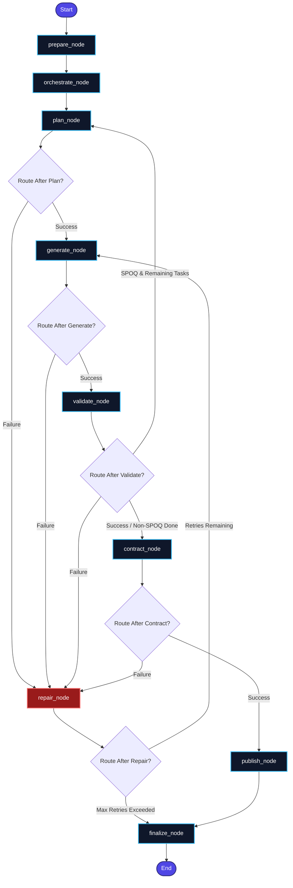
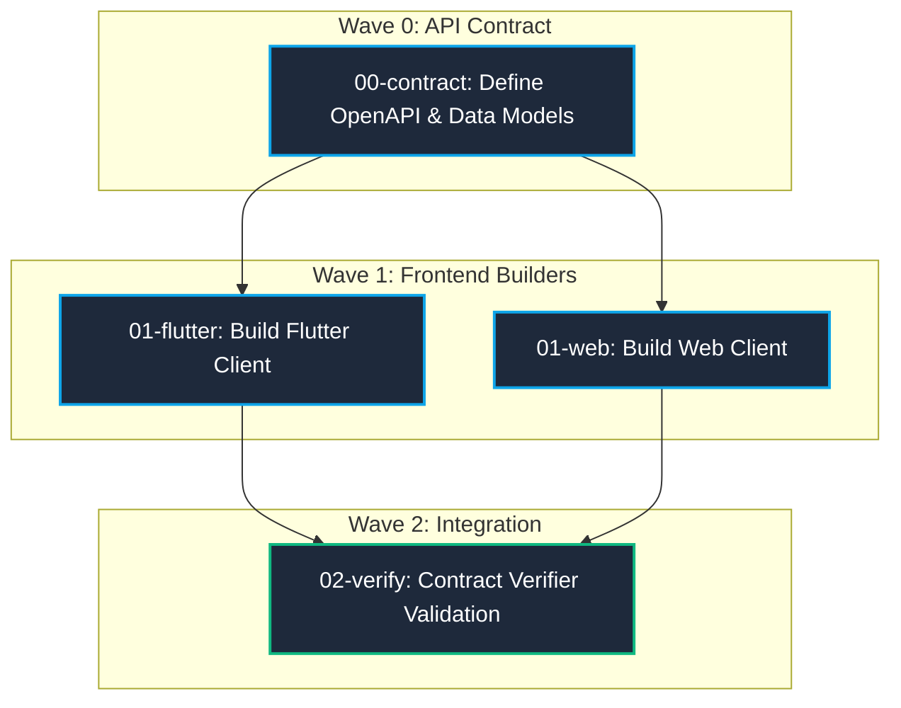
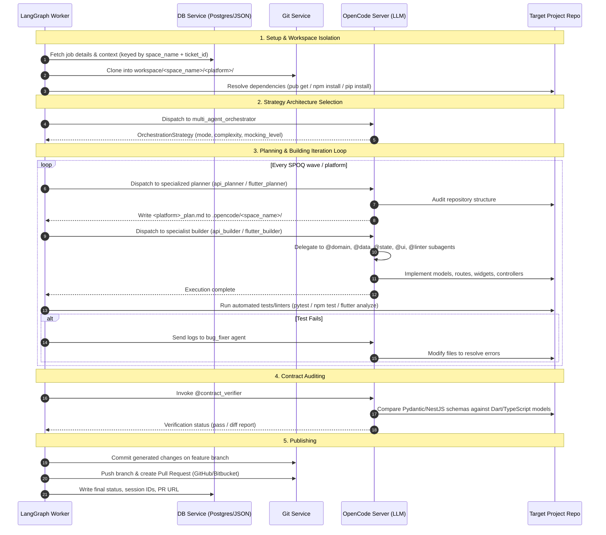

# Multi-Agent Platform & Orchestration Architecture

This document provides a comprehensive view of the **ebprocess-development** system. It describes how the stateful pipeline coordinates multiple specialist agents to execute complex, multi-project, multi-platform development tasks using LangGraph, OpenCode, and **SPOQ (Specialist Orchestrated Queuing)**.

---

## 1. High-Level System Architecture

The core of `ebprocess-development` is a **stateful orchestration graph** built on top of **LangGraph**. The pipeline coordinates repository setup, ticket analysis, specialist planning, source code generation, automated verification (linters/tests), contract checking, and publishing.

Multiple independent projects (e.g. *Project Alpha*, *Project Beta*) can run **concurrently** through the same pipeline because all per-project state — plan files, task contexts, and SPOQ queues — is **isolated by `space_name`** inside the `.opencode/<space_name>/` storage directory.

### LangGraph Stateful Pipeline



---

## 2. Multi-Project Workspace Isolation

Each project is identified by a **`space_name`** (e.g. `"ebsprinter"`, `"ebprocess"`). All pipeline nodes resolve storage paths through `JobContext.project_storage_dir()`, ensuring **zero cross-project collisions** when multiple LangGraph runs execute concurrently.

### Directory Layout

```
workspace/                               ← gitignored; runtime project checkouts
├── ebsprinter/                          ← space_name
│   ├── api/                             ← git checkout per platform
│   └── flutter/
│
└── ebprocess/
    ├── api/
    ├── cms/
    └── flutter/

.opencode/                               ← gitignored; agent state and plans
├── sessions.json                        ← shared session registry (cross-project)
├── jobs.json                            ← shared job registry (cross-project)
│
├── ebsprinter/                          ← project-scoped storage (space_name)
│   ├── tasks/
│   │   ├── api_context.json
│   │   └── flutter_context.json
│   ├── api_plan.md
│   ├── flutter_plan.md
│   └── spoq/
│       └── epics/active/EPIC-101/
│           ├── EPIC.md
│           └── tasks/
│               ├── 00-contract.yml
│               └── 01-flutter.yml
│
└── ebprocess/                           ← isolated from ebsprinter
    ├── tasks/
    ├── api_plan.md
    └── spoq/epics/active/EPIC-201/
```

### Key Isolation Rule

`JobContext.project_storage_dir(base)` resolves to `<OPENCODE_PROJECT_DIR>/<space_name>/` and is the **single canonical method** used by all nodes to resolve plan files, context files, and SPOQ directories. The shared registries (`sessions.json`, `jobs.json`) use `<ticket_id>_<platform>` keyed entries so concurrent projects never overwrite each other's session mappings.

---

## 3. Orchestration Strategies & Execution Modes

The `orchestrate_node` parses ticket properties (summary, description, acceptance criteria) and active platforms to choose an `OrchestrationStrategy`.

### Decision Process

1. **LLM Evaluation**: Dispatches to the `multi_agent_orchestrator` agent on the OpenCode server to evaluate complexity and return a structured `OrchestrationStrategy` schema.
2. **Rule-Based Heuristic Fallback**: If the LLM call fails, applies regex keyword classification:
   - **Offline-First Detection**: Scans for `offline`, `local storage`, `sqlite`, `hive`, `drift`, `isar`, `cache`.
   - **UI/UX-Only Detection**: Presentation keywords (`style`, `screen`, `widget`) with no backend elements (`api`, `db`, `migration`).

### `OrchestrationStrategy` Schema

| Field | Values | Description |
|:---|:---|:---|
| `complexity` | `low` / `medium` / `high` | Ticket complexity rating |
| `execution_mode` | `spoq` / `parallel` / `sequential` | Pipeline execution mode |
| `mocking_level` | `live` / `mock_repositories` / `ui_stubs` | Frontend mocking strategy |
| `offline_first` | `bool` | Enable offline-first architecture |
| `ui_ux_only` | `bool` | Skip backend if pure UI ticket |
| `max_repair_iterations` | `int` | Repair loop budget (default: 3) |
| `stages` | `List[List[str]]` | Platform execution waves (sequential/parallel mode) |

### Core Execution Modes

| Mode | Description |
|:---|:---|
| **Sequential** | Platforms execute one after another (wave-based `stages` list) |
| **Parallel** | All platforms run concurrently with `asyncio.gather` |
| **SPOQ** | Wave-based DAG dispatch — complex multi-platform epics with dependency ordering |

---

## 4. Specialist Orchestrated Queuing (SPOQ)

SPOQ organizes multi-platform epics into a **Direct Acyclic Graph (DAG)** of `SPOQTask` YAML files. Tasks are dispatched in **waves** based on completed dependencies.

### SPOQ Task Schema (`SPOQTask`)

| Field | Description |
|:---|:---|
| `id` | Unique task ID (e.g. `00-contract`, `01-flutter`) |
| `phase` | Execution wave number |
| `dependencies` | List of task IDs that must be `completed` first |
| `skills_required` | Platforms to activate (e.g. `["api", "flutter"]`) |
| `files_to_touch` | Hints for the builder agent |
| `outputs` | Expected deliverables |
| `acceptance_criteria` | Validation pass conditions |

### Example Wave Dispatch



After each `validate` pass in SPOQ mode, `get_active_wave_tasks()` reads the SPOQ epic directory and returns `pending` tasks whose `dependencies` are all `completed`. The graph loops back to `plan → generate → validate` until all tasks are done, then advances to `publish`.

---

## 5. Specialist Agent Pool

All agent profiles live in `.opencode/agents/`. Primary agents are invoked directly by pipeline nodes. Subagents are **delegated to via `@agent-name` syntax** inside primary agent prompts — OpenCode spawns them as nested task processes.

### Primary Agents

| Agent | Platform / Layer | Primary Responsibility |
|:---|:---|:---|
| `multi_agent_orchestrator` | Cross-Platform | Parses tickets, returns `OrchestrationStrategy` JSON |
| `api_planner` | API (NestJS / FastAPI) | Audits modules, writes `api_plan.md` |
| `api_builder` | API (NestJS / FastAPI) | Implements schemas, controllers, repositories, and tests |
| `flutter_planner` | Flutter / Dart | Reviews widget trees, writes `flutter_plan.md` |
| `flutter_builder` | Flutter / Dart | Generates Dart widgets, models, controllers, runs `build_runner` |
| `web_planner` | React / Next.js | Plans components, state hooks, routing |
| `web_builder` | React / Next.js | Scaffolds TypeScript pages, styles, and integration tests |
| `bug_fixer` | Cross-Platform | Diagnoses and patches compiler or runtime failures |
| `ui_refiner` | Flutter / Web | Applies pixel-accurate UI polish against Figma specs |

### Subagents (Delegated via `@` in Builder Prompts)

| Subagent | Delegated From | Responsibility |
|:---|:---|:---|
| `@domain` | `flutter_builder` | Dart entity, repository interface, and use-case generation |
| `@data` | `flutter_builder` | Remote data sources, DTOs, and API adapters |
| `@state` | `flutter_builder` | Riverpod/BLoC provider and state management wiring |
| `@ui` | `flutter_builder` | Widget tree, screen layouts, and routing |
| `@linter` | `flutter_builder` | Post-generation Dart analysis and auto-fix pass |
| `@design_system` | `flutter_builder` / `@ui` | Design tokens, theme constants, and shared style utilities |
| `@graphql` | `api_builder` | GraphQL schema, resolver, and query generation |
| `@localization` | `flutter_builder` / `@ui` | ARB file generation and l10n integration |
| `@contract_verifier` | `generate_node` | Backend schema vs. frontend model cross-verification |
| `@figma_assets` | `flutter_planner` | Figma URL extraction of design tokens and visual specs |

### Subagent Delegation Pattern

```
flutter_builder (Primary)
    ├── @domain  → lib/domain/entities/, use_cases/
    ├── @data    → lib/data/models/, repositories/, data_sources/
    ├── @state   → lib/presentation/providers/ or blocs/
    ├── @ui      → lib/presentation/screens/, widgets/
    │   └── @design_system  → lib/core/theme/
    │   └── @localization   → lib/l10n/
    └── @linter  → runs flutter analyze --fix
```

---

## 6. End-to-End Pipeline Execution Lifecycle



---

## 7. Key Data Schemas

### `JobContext` — Pipeline Execution Context

Carries all parameters for a single job. The `space_name` field drives all workspace and storage path resolution.

| Field | Type | Description |
|:---|:---|:---|
| `space_name` | `str` | Project identifier — used as workspace and storage key |
| `ticket_id` | `str` | Ticket/issue identifier (e.g. `EPIC-101`) |
| `platforms` | `List[str]` | Active platforms: `api`, `flutter`, `web`, `cms` |
| `repo_path` | `str` | Resolved host path: `workspace/<space_name>/` |
| `spoq_epic_dir` | `Optional[str]` | Path to active SPOQ epic directory |
| `starter_types` | `Dict[str, str]` | Per-platform scaffold: `{"api": "nestjs", "flutter": "flutter"}` |
| `ticket_label` | `str` | `feature` / `bug` / `ui_refine` — controls agent selection |
| `mocking_level` | `str` | `live` / `mock_repositories` / `ui_stubs` |

**`project_storage_dir(base)`** → resolves `.opencode/<space_name>/` and creates it if needed. All plan files, task contexts, and SPOQ directories are written under this path.

### `GraphState` — LangGraph Node State

| Field | Type | Description |
|:---|:---|:---|
| `context` | `JobContext` | Active job parameters |
| `strategy` | `OrchestrationStrategy` | Execution strategy from orchestrate node |
| `current_stage` | `int` | Current SPOQ/sequential wave index |
| `platform_results` | `Dict[str, JobResult]` | Per-platform build results |
| `done_platforms` | `Dict[str, bool]` | Validation pass status per platform |
| `opencode_session_ids` | `Dict[str, str]` | Resumable session IDs per platform |
| `is_spoq` | `bool` (property) | True when execution_mode is `"spoq"` |

---

## 8. Project Codebase Layout

```
.
├── docker-compose.yml              # Multi-container local execution setup
├── pyproject.toml                  # Python package configuration (Poetry/Pyright)
├── .gitignore                      # Excludes workspace/, .opencode/, .env
├── workspace/                      # (gitignored) Runtime project checkouts
│   └── <space_name>/
│       └── <platform>/             # e.g. flutter/, api/, cms/
│
├── .opencode/                      # (gitignored) Agent state and plans
│   ├── sessions.json               # Shared session registry
│   ├── jobs.json                   # Shared job registry
│   ├── agents/                     # Agent profile definitions (19 agents)
│   │   ├── multi_agent_orchestrator.md
│   │   ├── flutter_planner.md / flutter_builder.md
│   │   ├── api_planner.md / api_builder.md
│   │   ├── web_planner.md / web_builder.md
│   │   ├── domain.md / data.md / state.md / ui.md
│   │   ├── linter.md / design_system.md / localization.md / graphql.md
│   │   ├── bug_fixer.md / ui_refiner.md
│   │   ├── contract_verifier.md / figma_assets.md
│   └── <space_name>/               # Project-scoped storage (isolated per project)
│       ├── tasks/
│       │   └── <platform>_context.json
│       ├── <platform>_plan.md
│       └── spoq/epics/active/<ticket_id>/
│
└── src/
    └── ebdev/
        ├── config.py               # Environment configuration loader
        ├── core/
        │   ├── exceptions.py       # Domain exceptions (GitServiceError, etc.)
        │   ├── graph.py            # LangGraph StateGraph pipeline & routing logic
        │   ├── nodes/              # Pipeline node steps
        │   │   ├── prepare.py      # Workspace clone & dependency setup (per-platform, concurrent)
        │   │   ├── orchestrate.py  # Strategy selection & SPOQ DAG generation
        │   │   ├── plan.py         # Concurrent planner invocation
        │   │   ├── generate.py     # Concurrent builder invocation
        │   │   ├── validate.py     # Platform linter/test runner
        │   │   ├── contract.py     # Cross-platform schema contract verifier
        │   │   ├── repair.py       # Failure analysis and error-guided repair
        │   │   ├── publish.py      # Branch commit and PR creation
        │   │   └── finalize.py     # Job status persistence
        │   └── spoq_utils.py       # SPOQ task parsing and wave resolution
        ├── models/
        │   └── schemas.py          # JobContext, GraphState, SPOQTask, OrchestrationStrategy
        ├── platforms/              # Platform strategy implementations
        │   ├── base.py             # PlatformStrategy abstract interface
        │   ├── flutter.py          # FlutterStrategy (pub get, build_runner, analyze)
        │   └── api.py              # ApiStrategy (npm install, nest build, eslint)
        └── services/
            ├── db.py               # Job tracking & local JSON fallback engine
            ├── flutter_cmd.py      # Headless Flutter CLI executor
            ├── git.py              # Git repository, branch, and PR provider
            ├── opencode.py         # SSE-streaming OpenCode client & session manager
            ├── prompts.py          # Prompt builders with container path translation
            └── starter.py          # Project skeleton bootstrapping
```


### LangGraph Stateful Pipeline

The workflow starts in the `prepare` node and dynamically routes through planning, generation, validation, contract verification, and error repair before publishing changes:


