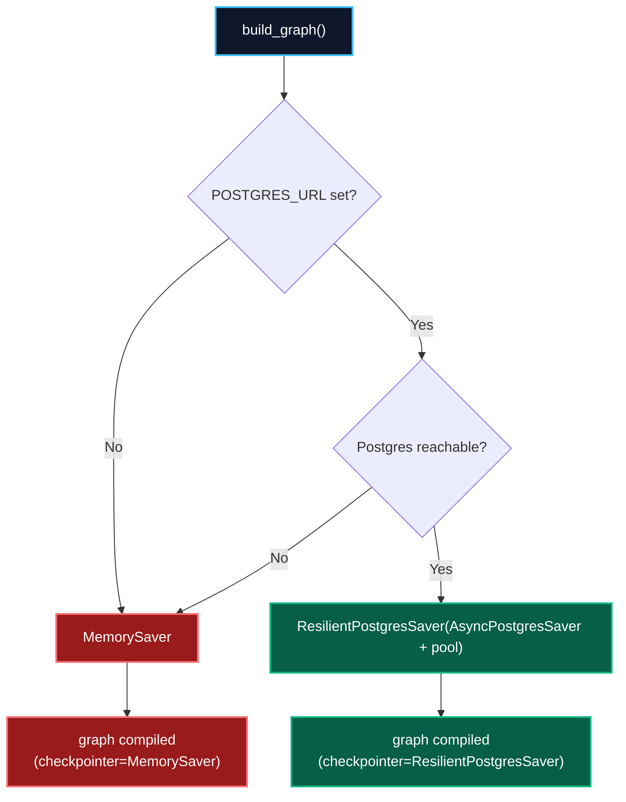
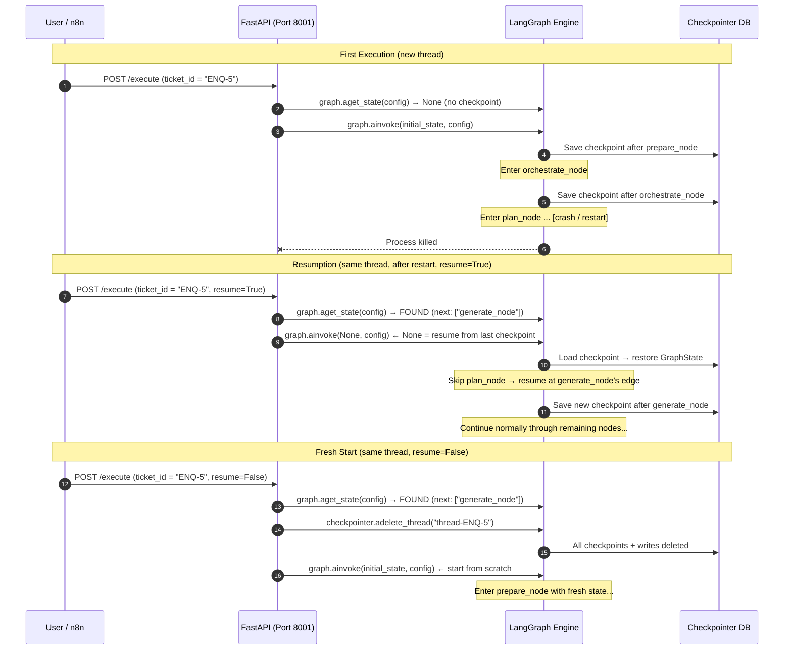
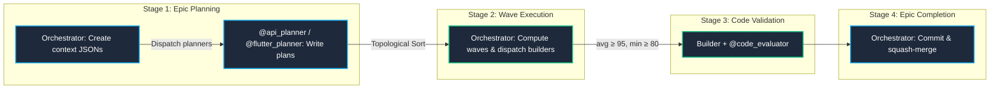
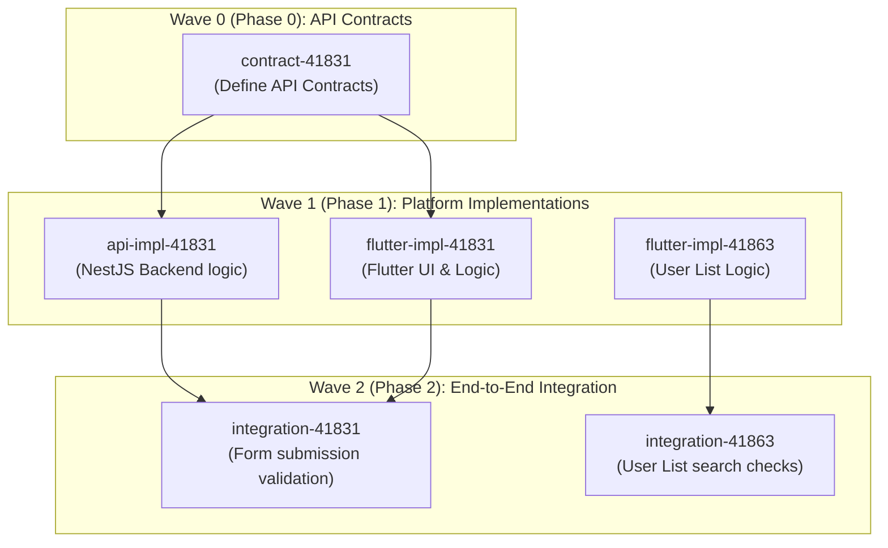
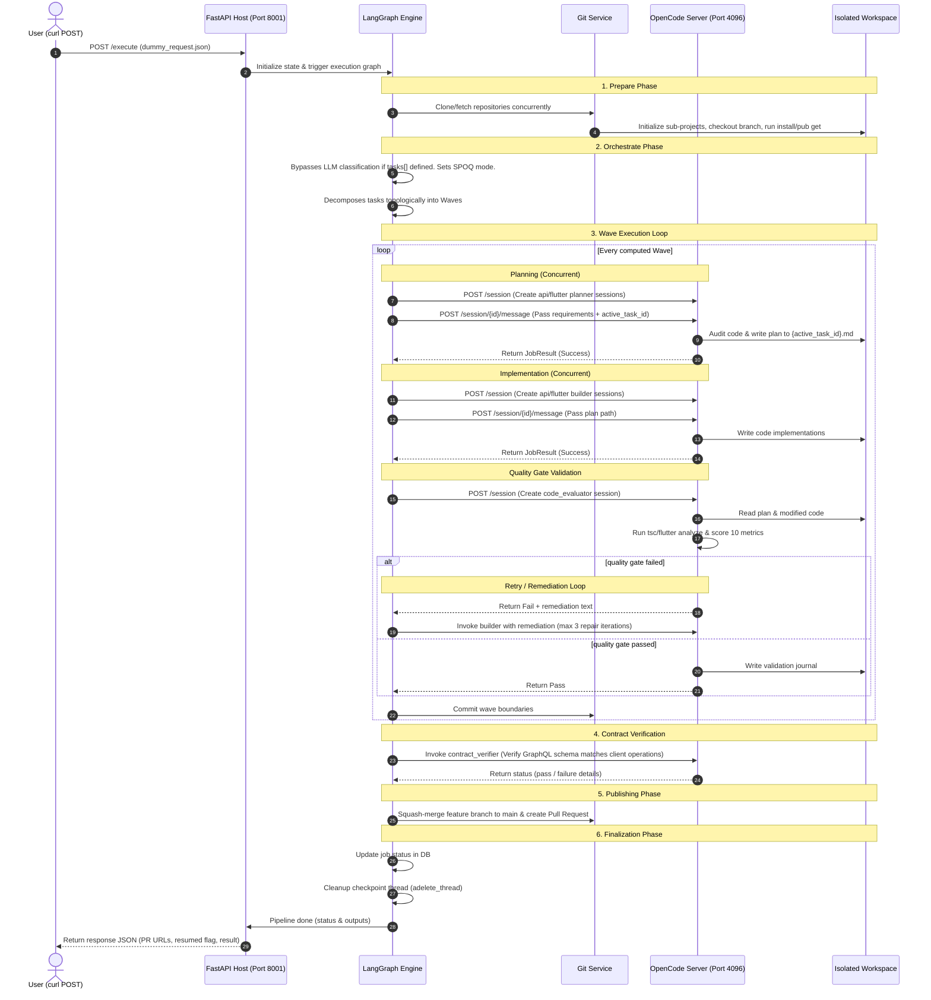

# Multi-Agent Platform & Orchestration Architecture

This document provides a comprehensive view of the **ebprocess-development** system. It describes how the stateful pipeline coordinates multiple specialist agents to execute complex, multi-project, multi-platform development tasks using LangGraph, OpenCode, and **SPOQ (Specialist Orchestrated Queuing)** (arXiv:2606.03115v1).

---

## 1. High-Level System Architecture

The core of `ebprocess-development` is a **stateful orchestration graph** built on **LangGraph**. The pipeline coordinates workspace setup, epic planning, wave-based task execution, code validation (10-metric scoring), contract verification, and publishing.

Multiple independent projects run **concurrently** because all per-project state — epics, tasks, journals — is **isolated by `space_name`** inside the `.ebpearls/` directory.

### LangGraph Stateful Pipeline


> [!NOTE]
> **Dual-System Architecture**: The system consists of two separate components running side-by-side:
> 1. **Python LangGraph Pipeline**: A stateful orchestration host (listening on port `8001`). It manages job parameters, branches, code compilation triggers, and coordinates the wave-based topological dispatch loops.
> 2. **OpenCode Headless Server**: A separate agent execution engine (running on port `4096`). The pipeline never executes agent LLM/tool loops directly; it instead delegates planning, building, and evaluation steps to OpenCode via REST API calls.

Each `generate_node` invocation dispatches a builder agent, which writes code and then triggers the validation node. The **`@code_evaluator`** agent independently scores the output against 10 quality metrics before marking the task complete.

---

## 2. LangGraph Checkpointing & State Persistence

The pipeline is built on LangGraph's native **checkpointing** system, which persists the full `GraphState` after every node transition. This is what enables long-running SPOQ epic executions to survive process restarts and resume from the exact last node without re-running completed work.

### 2.1 Core Concept: Thread ID as Memory Pointer

Every pipeline execution is keyed to a unique **`thread_id`** — a string that acts as a stable "memory pointer" into the checkpointer database. The pipeline uses LangGraph's state query API to decide whether to resume or start fresh:

```python
# api/main.py:94-155
config = {"configurable": {"thread_id": f"thread-{request.ticket_id}"}}

# Check if a checkpoint exists for this thread
existing_state = await graph.aget_state(config)

if existing_state is not None and existing_state.next:
    if request.resume:          # resume=True (default)
        # None input = load last checkpoint & continue from interrupted node
        final_state = await graph.ainvoke(None, config=config)
    else:                       # resume=False — clear & start fresh
        await checkpointer.adelete_thread(f"thread-{request.ticket_id}")
        final_state = await graph.ainvoke(initial_state, config=config)
else:
    final_state = await graph.ainvoke(initial_state, config=config)
```

The `thread_id` is derived from the ticket identifier (e.g. `thread-ENQ-5`). The `ExecutePipelineRequest` model carries a `resume: bool = True` field. When the same `thread_id` is used again:
- **Existing thread + `resume=True`**: `graph.aget_state()` finds pending nodes → `graph.ainvoke(None, config)` loads the last checkpoint and resumes from the interrupted node's outbound edge.
- **Existing thread + `resume=False`**: Thread history is cleared via `adelete_thread()`, then execution starts fresh.
- **New thread**: Execution starts fresh from the entry point (`prepare_node`).

This means **no external state tracking is needed** to know "where are we in the pipeline?" — the checkpoint history is the single source of truth.

### 2.2 Checkpointer Backends

The graph is compiled with a **checkpointer** (`src/ebdev/core/graph.py:277-432`):

| Backend | Storage | Persistence | When Used |
|:---|:---|:---|:---|
| **`ResilientPostgresSaver`** | PostgreSQL database | Survives restarts | Production — `POSTGRES_URL` is set and Postgres is reachable |
| **`MemorySaver`** (also `InMemorySaver`) | In-memory dict | Lost on process exit | Development/testing — Postgres unconfigured or unreachable |

`ResilientPostgresSaver` is a **retry-wrapping proxy** around LangGraph's `AsyncPostgresSaver` that inherits from `BaseCheckpointSaver` (required by LangGraph's `isinstance` validation). It adds exponential-backoff retry logic (max 3 attempts) to all six checkpoint operations, transparently recovering from transient Postgres errors (`AdminShutdown`, `OperationalError`, `InterfaceError`):

| Proxied Method | Purpose |
|:---|:---|
| `aget_tuple(config)` | Load latest or specific checkpoint for a thread |
| `aput(config, checkpoint, metadata, new_versions)` | Persist a checkpoint at a super-step boundary |
| `aput_writes(config, writes, task_id, task_path)` | Persist intermediate node writes (fault-tolerance) |
| `alist(config, *, filter, before, limit)` | List checkpoint history for a thread |
| `adelete_thread(thread_id)` | Delete all checkpoints + writes for a thread |
| `asetup()` | Create tables if needed |



The underlying `AsyncPostgresSaver` uses an `AsyncConnectionPool` (`psycopg_pool`, min=1, max=10 connections) with `autocommit=True`.

Checkpoints are persisted with `durability="async"` — writes happen asynchronously while the next node executes, giving a good balance of performance and persistence. If the process crashes mid-step, at most one node's progress is lost and the graph resumes from the last successful checkpoint.

### 2.3 What Gets Checkpointed — The Full `GraphState`

After every node (prepare, orchestrate, plan, generate, validate, contract, repair, publish, finalize), the **entire** `GraphState` Pydantic model is serialized and stored. This includes:

| Group | Fields | Why It Matters for Resumption |
|:---|:---|:---|
| **Execution context** | `context` (full `JobContext` with ticket, repo_path, platforms, feature_name) | Knows *what* is being built and *where* |
| **Strategy** | `strategy` (execution_mode, complexity, max_repair_iterations) | Knows *how* to execute |
| **Wave progress** | `current_stage` (wave index), `spoq_tasks[]` (with per-task `status`: pending/in_progress/completed/blocked) | Knows *exactly which wave and tasks* are done vs remaining |
| **Platform state** | `platform_results`, `done_platforms`, `failed_platforms` | Per-platform build outcome tracking |
| **Session handles** | `opencode_session_ids` (dict mapping platform to OpenCode session ID) | Enables resuming LLM conversations instead of restarting |
| **Shared context** | `shared_context` (arbitrary dict for cross-node data) | Carries data between waves (e.g. API contract URLs) |
| **Progress flags** | `done`, `failed`, `last_node`, `status_message`, `retry_count` | Routing decisions and status reporting |

> [!NOTE]
> The `context.validation_errors` and `context.repair_iteration` fields track repair-loop state within a single run. These are included in the checkpoint so that a resumed run knows its remaining repair budget.

### 2.4 Checkpoint Storage — Postgres Database Schema

The `AsyncPostgresSaver` creates and manages three tables in the configured Postgres database:

| Table | Purpose | Content |
|:---|:---|:---|
| **`checkpoints`** | Timestamped state snapshots | Serialized `GraphState` + metadata (checkpoint_id, thread_id, parent_checkpoint_id, step, node name) |
| **`checkpoint_writes`** | Pending writes | Channel writes queued between nodes (ensures no data loss during transitions) |
| **`checkpoint_blobs`** | Channel blob storage | Large binary channel values referenced by checkpoints |

These tables are **managed entirely by LangGraph internally** — application code never writes to them directly. The `saver.setup()` call in `graph.py:272` creates them automatically on first run.

Additionally, a companion **`jobs`** table (managed by `src/ebdev/services/db.py`) stores job-level metadata for external visibility:

```sql
CREATE TABLE IF NOT EXISTS jobs (
    job_id VARCHAR(255) PRIMARY KEY,
    status VARCHAR(50),          -- in_progress / complete / failed
    summary TEXT,
    errors TEXT[],
    warnings TEXT[],
    opencode_session_id VARCHAR(255),
    jira_id VARCHAR(255),
    created_at TIMESTAMP,
    updated_at TIMESTAMP
);

```

### 2.4.1 Checkpoint Lifecycle Management

Checkpoint lifecycle is managed by `src/ebdev/services/checkpoint.py`, which provides:

| Function | Purpose |
|:---|:---|
| `cleanup_thread(thread_id)` | Deletes all checkpoints + writes for a completed thread via `adelete_thread()`. Respects the `CHECKPOINT_CLEANUP_ON_COMPLETE` env var (default `true`). Skips gracefully for `MemorySaver` (no persistent storage to clean). |
| `get_thread_history(thread_id, limit)` | Returns timestamped checkpoint history for time-travel debugging and audit trails. |

Cleanup is called from `finalize_node` after the job completes — short-term thread-scoped memory is no longer needed once the pipeline finishes, so checkpoints are deleted to prevent unbounded storage growth. The compact `jobs` table row is retained for audit.

### 2.5 Resumption Mechanism — Step by Step

The `execute_pipeline` endpoint (`src/ebdev/api/main.py:94`) implements **checkpoint-aware resume** using LangGraph's native state query. Before executing, it calls `graph.aget_state(config)` to determine whether a checkpoint exists:

* **No checkpoint**: Starts fresh — `graph.ainvoke(initial_state, config)`
* **Checkpoint with pending nodes + `resume=True`**: Resumes — `graph.ainvoke(None, config)` (LangGraph loads the last checkpoint state and continues from where it was interrupted)
* **Checkpoint with pending nodes + `resume=False`**: Clears thread history via `adelete_thread()`, then starts fresh

The `ExecutePipelineRequest` Pydantic model includes a `resume: bool = True` field to control this behavior. The response includes `"resumed": true/false` for caller visibility.



**Key behaviors on resumption:**

1. **`graph.aget_state(config)` checks for existing checkpoints** — returns `StateSnapshot` with `next` nodes (non-empty = interrupted, empty `()` = completed).
2. **`graph.ainvoke(None, config)` resumes** — passing `None` as the input tells LangGraph to load the last checkpoint state and continue from the interrupted node's outbound edge.
3. **Restores `GraphState`** — all task statuses, wave indices, and platform results are exactly as they were.
4. **Skips completed nodes** — execution resumes from the edge *after* the last completed node, not from the entry point.
5. **SPOQ tasks stay consistent** — `spoq_tasks[]` statuses are restored, so `get_state_active_tasks()` correctly identifies remaining work.
6. **OpenCode sessions reconnect** — the `opencode_session_ids` dict is restored; builders can resume LLM conversations via `session_id` rather than restarting them.

> [!NOTE]
> When `resume=False`, the checkpointer's `adelete_thread()` is called to purge all checkpoints and writes for the thread before starting fresh. This is distinct from the `cleanup_thread()` call in `finalize_node` — the latter runs *after* successful completion, while the former is a deliberate "start over" action requested by the caller.

### 2.6 SPOQ Wave Resumption in Detail

The SPOQ execution mode most benefits from checkpointing because it runs multiple waves over extended periods:

```
Wave 0: API contract definitions     → checkpoint
Wave 1: API + Flutter implementation  → checkpoint (survives restart here)
Wave 2: End-to-end integration tests  → checkpoint
Epic completion                       → final checkpoint
```

Consider an epic with 6 tasks across 3 waves. If the process crashes after completing Wave 1:

| Component | State Before Crash | State After Resume |
|:---|:---|:---|
| `current_stage` | `1` (Wave 1 done) | `1` — resumes at Wave 2 |
| `spoq_tasks[0]` (contract) | `completed` | `completed` — NOT re-run |
| `spoq_tasks[1]` (api-impl) | `completed` | `completed` — NOT re-run |
| `spoq_tasks[2]` (flutter-impl) | `completed` | `completed` — NOT re-run |
| `spoq_tasks[3]` (integration test) | `pending` | `pending` — picked up by Wave 2 |
| `platform_results` | `{"api": JobResult(...), "flutter": JobResult(...)}` | Fully restored |
| `opencode_session_ids` | `{"api": "sess-123", "flutter": "sess-456"}` | Restored (can resume LLM chat) |

The orchestrator node calls `get_state_active_tasks(state.spoq_tasks)` which scans task statuses — only `pending`/`blocked` tasks with all dependencies satisfied are dispatched. Since the DAG and statuses are checkpointed together, the topological wave computation is deterministic and idempotent.

### 2.7 Dual-Database Model

The system uses **two separate persistence layers** on the same PostgreSQL instance:

```
┌─────────────────────────────────────────────────────────────────┐
│                   PostgreSQL (POSTGRES_URL)                      │
├────────────────────────────┬────────────────────────────────────┤
│   LangGraph Checkpointer    │         Application Jobs           │
│   (auto-managed)            │         (manual via db.py)         │
├─────────────────────────────┼────────────────────────────────────┤
│ Table: checkpoints          │ Table: jobs                        │
│ Table: checkpoint_writes    │                                    │
│ Table: checkpoint_blobs     │                                    │
├─────────────────────────────┼────────────────────────────────────┤
│ Purpose:                    │ Purpose:                           │
│ • Per-node state snapshots  │ • Job-level status for external    │
│ • Resumption from last node │   monitoring/API responses          │
│ • Thread isolation           │ • Session ID lookup by ticket     │
│ • Fault-tolerant pending    │ • JSON fallback to .opencode/      │
│   writes (aput_writes)      │ • Compact result retained for      │
│ • LangGraph-internal only   │   audit after checkpoint cleanup   │
├─────────────────────────────┼────────────────────────────────────┤
│ Accessed by:                │ Accessed by:                       │
│ • graph.ainvoke()           │ • update_job_status()              │
│ • graph.aget_state()        │ • save_session_id()                │
│ • graph.ainvoke(None, ...)  │ • get_session_id()                 │
│ • ResilientPostgresSaver    │ • sync_state_to_db()               │
│ • checkpoint.cleanup_thread │ • checkpoint.cleanup_thread        │
│                             │ • checkpoint.get_thread_history    │
└─────────────────────────────┴────────────────────────────────────┘

Plus file-system artifacts (not Postgres):
  workspace/{space}/.ebpearls/Epic-{id}/
    ├── EPIC.md, {task}.md         ← Human-readable plans
    ├── context_{platform}.json    ← Machine-readable context
    └── journals/                  ← Confidence-scored session logs
```

| Layer | Storage | Lifespan | Purpose |
|:---|:---|:---|:---|
| **Checkpoints** (Postgres `checkpoints*` tables) | PostgreSQL | Temporary (cleaned on completion) | LangGraph-internal: resume execution from exact node, pending writes recovery |
| **Jobs** (Postgres `jobs` table) | PostgreSQL | Persistent across restarts | Application-level: job status, session IDs, monitoring — retained after checkpoint cleanup |
| **File artifacts** (`.ebpearls/`) | Filesystem | Permanent | Human-auditable: plans, journals, contexts |

### 2.8 Durability, Cleanup & Lifecycle

#### Durability Mode

The pipeline runs with LangGraph's `durability="async"` mode (`src/ebdev/api/main.py:64`):

| Mode | When Writes Persist | Performance | Data Loss Risk | When to Use |
|:---|:---|:---|:---|:---|
| `"exit"` | On graph exit only | Fastest | Cannot recover from mid-run crash | Not used |
| **`"async"`** (current) | Asynchronously during next step | Good | At most 1 node's progress on crash | **Production default** |
| `"sync"` | Synchronously before next step | Slowest | None | Critical-only steps |

With `"async"`, if the process crashes mid-step, at most one node's progress is lost — the graph resumes from the last successfully-written checkpoint. This balances performance and fault tolerance for a development pipeline where recomputing one node is acceptable.

#### Checkpoint Lifecycle

```
                     [job starts]
                          │
          ┌───────────────▼────────────────┐
          │ graph.ainvoke(initial_state)    │
          │ Each node transition creates a  │
          │ checkpoint (checkpoints + writes)│
          └───────────────┬────────────────┘
                          │
                ┌─────────▼──────────┐
                │    job completes    │
                └─────────┬──────────┘
                          │
                ┌─────────▼──────────┐
                │  finalize_node:     │
                │  checkpoint.        │
                │  cleanup_thread()   │
                │  → adelete_thread() │
                └─────────┬──────────┘
                          │
          ┌───────────────▼────────────────┐
          │ checkpoints table: emptied      │
          │ checkpoint_writes: emptied      │
          │ jobs table: compact result row  │
          │   retained for audit            │
          └────────────────────────────────┘
```

The `CHECKPOINT_CLEANUP_ON_COMPLETE` env var (default `true`, `src/ebdev/config.py:95`) controls whether checkpoints are deleted on completion. Set to `"false"` to retain checkpoint history for debugging or time-travel inspection.

#### Resume vs Fresh Start

The `resume` field on `ExecutePipelineRequest` (default `true`) controls how existing thread checkpoints are handled:

| Scenario | `resume` | Behavior |
|:---|:---|:---|
| No checkpoint exists | ignored | Starts fresh from `prepare_node` |
| Checkpoint exists, graph completed | ignored | Starts fresh from `prepare_node` |
| Checkpoint exists, graph interrupted | `true` | `graph.ainvoke(None)` — resumes from last node |
| Checkpoint exists, graph interrupted | `false` | `adelete_thread()` + `graph.ainvoke(initial_state)` — cleared + fresh |

---

## 3. Multi-Project Workspace Isolation

Each project is identified by a **`space_name`** (e.g. `"ebsprinter"`, `"ebprocess"`, `"AgentSwipe"`). All pipeline nodes resolve storage paths through `JobContext.project_storage_dir()`, ensuring **zero cross-project collisions**.

### Directory Layout

```text
workspace/                               ← runtime project checkouts
└── {space_name}/                        ← e.g. AgentSwipe
    ├── .ebpearls/                       ← Isolated runtime storage
    │   ├── ROADMAP.md                   ← Cross-epic registry
    │   ├── Epic-{id}/                   ← e.g. Epic-44445
    │   │   ├── EPIC.md                  ← Goal, architecture, DAG, wave assignments
    │   │   ├── {task-name}.md           ← Task plan Markdown (e.g. api-impl-41831.md)
    │   │   ├── context_api.json         ← Platform context (generated)
    │   │   ├── context_flutter.json     ← Platform context (generated)
    │   │   └── journals/                ← Confidence-scored session journals
    │   │       ├── 2026-07-06_development_api-builder.md
    │   │       └── JOURNAL.md           ← Consolidated epic journal
    │   └── Epic-{id}/                   ← Multiple epics can coexist
    │       └── ...
    │
    ├── {space_name}-services/           ← API platform (NestJS)
    └── {space_name}_flutter/            ← Flutter platform
```

### Isolation Rule

`JobContext.project_storage_dir()` resolves to `<workspace_dir>/<space_name>/.ebpearls/`. All SPOQ data uses paths relative to this isolated subdirectory. No two projects share state.

---

## 4. Orchestration Strategies & Execution Modes

The `orchestrate_node` parses ticket properties to choose an `OrchestrationStrategy`.

### Decision Process

1. **LLM Evaluation**: Dispatches a single-turn prompt to the `multi_agent_orchestrator` agent to evaluate ticket complexity and return a structured `OrchestrationStrategy` schema.
2. **Rule-Based Heuristic Fallback**: If the LLM call fails, applies regex keyword classification:
   - **Offline-First Detection**: Scans for `offline`, `local storage`, `sqlite`, `hive`, `drift`, `isar`, `cache`.
   - **UI/UX-Only Detection**: Presentation keywords (`style`, `screen`, `widget`) with no backend elements (`api`, `db`, `migration`).

> [!IMPORTANT]
> **Dual Orchestration & Payload Bypass**:
> - The `orchestrate_node` dispatches to OpenCode's `multi_agent_orchestrator` only for the initial complexity and execution mode classification (using a single-turn prompt), not to manage the step-by-step SPOQ lifecycle.
> - The actual wave topological sorting, dispatch scheduling, retry/repair counts, and node transitions are driven entirely by the Python LangGraph code.
> - If the incoming request payload contains a predefined list of tasks (`tasks[]` is present, e.g. in `dummy_request.json`), the LLM orchestrator classification is completely bypassed. The execution mode is automatically set to `spoq`.

### `OrchestrationStrategy` Schema

| Field | Values | Description |
|:---|:---|:---|
| `complexity` | `low` / `medium` / `high` | Ticket complexity rating |
| `execution_mode` | `spoq` / `parallel` / `sequential` | Pipeline execution mode |
| `mocking_level` | `live` / `mock_repositories` / `ui_stubs` | Frontend mocking strategy |
| `offline_first` | `bool` | Enable offline-first architecture |
| `ui_ux_only` | `bool` | Skip backend if pure UI ticket |
| `max_repair_iterations` | `int` | Repair loop budget (default: 3) |
| `stages` | `List[List[str]]` | Platform execution waves (sequential/parallel mode) |

### Core Execution Modes

| Mode | Description |
|:---|:---|
| **Sequential** | Platforms execute one after another (wave-based `stages` list) |
| **Parallel** | All platforms run concurrently with `asyncio.gather` |
| **SPOQ** | Wave-based DAG dispatch with topological sort, code validation gate, and epic lifecycle |

---

## 5. Specialist Orchestrated Queuing (SPOQ)

SPOQ is a methodology (arXiv:2606.03115v1) for multi-agent software engineering. It combines wave-based topological dispatch, dual validation gates, confidence-scored session journals, and epic lifecycle management.

### Four-Stage Pipeline



### Epic Directory Structure

Each epic occupies its own directory under `.ebpearls/`:

```
.ebpearls/
  ROADMAP.md                    ← Centralized epic registry (status: planned → in-progress → done)
  Epic-{id}/                    ← e.g. Epic-44445 (one directory per epic)
    EPIC.md                     ← Goal, architecture, dependency DAG, wave assignments
    {task-name}.md              ← Task plan Markdown (e.g. api-impl-41831.md)
    context_api.json            ← Platform context (generated by orchestrator)
    context_flutter.json
    journals/                   ← Agent session journals
```

### Concrete Task DAG Example (from dummy_request.json)

For ticket `Epic-44445` containing platform configurations, the tasks are decomposed topologically into distinct waves:



### Code Validation Gate (10 Metrics)

After each task is implemented, the `@code_evaluator` agent independently scores the output against 10 metrics:

| # | Metric | What It Checks | Platform-Specific |
|---|--------|---------------|-------------------|
| 1 | **SC** — Syntactic Correctness | Compiles without errors? | `tsc --noEmit` / `flutter analyze` |
| 2 | **TE** — Test Existence | Unit/widget/integration tests exist? | Check test directories |
| 3 | **TP** — Test Pass Rate | Test suites execute and pass successfully? | `npm run test` / `flutter test` |
| 4 | **RF** — Requirements Fidelity | Matches task `acceptance_criteria`? | Compare code to Markdown spec |
| 5 | **SA** — SOLID Adherence | Follows SOLID principles? | NestJS module pattern / Clean Architecture |
| 6 | **SE** — Security | OWASP Top 10 free? | Guards, validation, no injection |
| 7 | **EH** — Error Handling | Failures handled gracefully? | `@Catch()` / `handleAPICall` |
| 8 | **SL** — Scalability | Hot-path complexity? | Pagination, indexes, `ListView.builder` |
| 9 | **CC** — Code Clarity | Readable and self-documenting? | Project convention conformance |
| 10| **CO** — Completeness | No TODOs/stubs? | No `FIXME`, no placeholders |

**Pass criteria:** `avg(M₁…M₁₀) ≥ 95 AND min(M₁…M₁₀) ≥ 80`

On failure: evaluator returns a **≤20 line remediation** with `file:line` references and numbered action items. The builder applies fixes and re-submits (max 3 iterations).

### Confidence Scoring & Session Journals

Every agent work session produces a journal entry — a structured Markdown file with YAML frontmatter that captures what was done, why, how confident the agent is, and what remains. Journals accumulate per-epic and provide the audit trail for the validation gate, multi-agent coordination, and post-mortem analysis.

#### Journal File Naming

```
.ebpearls/Epic-{id}/
  journals/
    {YYYY-MM-DD}_{session-type}_{agent-short}.md  ← Per-session entries
    JOURNAL.md                                     ← Consolidated epic journal
```

Each session file follows the pattern `{date}_{type}_{role}.md`:
- `date`: ISO 8601 date, e.g. `2026-07-06`
- `type`: One of `development`, `refactor`, `bugfix`, `validation`, `review`
- `role`: Short agent name, e.g. `builder`, `planner`, `evaluator`

Examples:
```
2026-07-06_development_api-builder.md
2026-07-06_validation_evaluator.md
2026-07-07_bugfix_api-fixer.md
```

#### YAML Frontmatter

```yaml
---
agent: Claude Code (Opus 4.5)
start_time: 2026-07-06T10:00:00Z
end_time: 2026-07-06T11:30:00Z
confidence: 0.88
session_type: development
files_modified:
  - libs/data-access/src/enquiry/enquiry.schema.ts
  - libs/data-access/src/enquiry/enquiry.repository.ts
  - apps/api/src/modules/enquiry/enquiry.module.ts
tasks_completed: 1
tasks_total: 3
---
```

| Field | Type | Description |
|:---|:---|:---|
| `agent` | `str` | Agent name and model tier, e.g. `"Claude Code (Opus 4.5)"` |
| `start_time` | `ISO 8601` | Session start timestamp in UTC |
| `end_time` | `ISO 8601` | Session end timestamp in UTC |
| `confidence` | `float (0.0–1.0)` | Calibrated self-assessment score |
| `session_type` | `str` | `development` / `refactor` / `bugfix` / `validation` / `review` |
| `files_modified` | `list[str]` | Every file touched during the session |
| `tasks_completed` | `int` | Number of tasks finished this session |
| `tasks_total` | `int` | Total tasks assigned in the current wave |

#### Confidence Score Calibration

Agents self-assess their output using a calibrated 0.0–1.0 scale before handing off to the `@code_evaluator`. The score is a subjective quality assessment, not an automated metric — it captures edge-case awareness, testing thoroughness, and known gaps the agent is aware of.

| Range | Label | When to Use |
|-------|-------|-------------|
| **0.95–1.0** | Production-ready | All acceptance criteria met, build/lint passes, edge cases handled, tests written and passing. Ready for merge without human review. |
| **0.85–0.94** | Well tested | Core functionality works with tests. Minor edge cases may be untested. Small refactors may be needed but no blocking issues. |
| **0.75–0.84** | Functional | Happy path works. Some edge cases untested, minor TODOs remain, or a few non-critical acceptance criteria are unmet. Needs additional validation. |
| **0.65–0.74** | Needs validation | Works in ideal conditions only. Known gaps in error handling, testing, or completeness. Flag for targeted review. |
| **< 0.65** | Experimental | Incomplete, known defects, or untested assumptions. Flag as requiring human review before proceeding to next wave. |

The evaluator cross-references the agent's confidence score against its own 10-metric scoring. A significant gap (e.g. agent claims 0.90 but evaluator scores below 80) triggers deeper review.

#### Journal Body (Markdown)

After the frontmatter, every journal entry follows a standardized Markdown body:

```markdown
## Summary
Brief 1–2 sentence overview of what was accomplished this session.

## Work Completed
- Task contract-41831: Defined Enquiry Mongoose schema with timestamps and soft-delete fields
- Task contract-41831: Created EnquiryRepository extending BaseRepo<EnquiryDocument>

## Changes Made
**Data Access Layer**
- `libs/data-access/src/enquiry/enquiry.schema.ts` — Created schema with title (required), description (required), isDeleted, deletedAt
- `libs/data-access/src/enquiry/enquiry.repository.ts` — Created repository extending BaseRepo with createEnquiry method

**Module Layer**
- `apps/api/src/modules/enquiry/enquiry.module.ts` — Wired MongooseModule.forFeature, providers, exports

**Registrations**
- `libs/data-access/src/index.ts` — Added `export * from './enquiry'`
- `libs/data-access/src/data-access.models.ts` — Registered { name: Enquiry.name, schema: EnquirySchema }
- `apps/api/src/app.module.ts` — Added EnquiryModule to imports and GraphQL include

## Issues Encountered
- None

## Testing
- Build check: `npm run build:api` — PASSED (0 errors)
- Lint check: `npm run lint` — PASSED (0 warnings)
- Manual schema verification: confirmed enquiry collection created in MongoDB with correct fields

## Next Steps
1. Builder must create CreateEnquiryInput DTO, EnquiryService, and EnquiryResolver
2. Builder must add i18n keys in en/enquiry.json and ne/enquiry.json
3. Flutter builder waits for API contract to be available before generating data layer
```

#### How Journals Drive the Pipeline

1. **Agent writes journal** → stored in `journals/{date}_{type}_{role}.md`
2. **Evaluator reads journal** → cross-references confidence score against 10-metric results
3. **Orchestrator consolidates** → merges per-session journals into `JOURNAL.md` at epic completion
4. **Audit trail** → every decision, file change, and issue is traceable across sessions

#### Consolidation

When all waves complete, the orchestrator produces `JOURNAL.md` — a chronological merge of all session journals with added sections:

```markdown
# Epic Journal: Epic-44445

## Session Index
| # | Date | Agent | Type | Confidence | Tasks |
|---|------|-------|------|------------|-------|
| 1 | 2026-07-06 | api_planner | plan | 0.92 | 1/1 |
| 2 | 2026-07-06 | api_builder | development | 0.88 | 1/3 |
| 3 | ... | ... | ... | ... | ... |

## Metrics Summary
- Average confidence across sessions: 0.87
- Evaluator pass rate: 100% (4/4 tasks passed 10-metric gate)

## Final Status
- Epic status: done
- Branch: feature/Epic-44445-enquiry → main (squash-merged)
- PR: https://bitbucket.org/.../pull-requests/42
```

### Epic Lifecycle

1. **Creation:** Orchestrator creates EPIC.md and `context_{platform}.json` context files → dispatches planners to write `{active_task_id}.md` plans → `.ebpearls/Epic-{id}/`
2. **Execution:** Orchestrator computes waves, dispatches builders, invokes evaluator per task. ROADMAP.md → `in-progress`
3. **Validation:** Each task scored against 10 metrics; failed tasks enter remediation loop
4. **Completion:** All tasks passed → ROADMAP.md → `done`. No filesystem move needed.
5. **Commit:** Branch-per-epic with squash-merge to main. Commits at wave boundaries.

---

## 6. Specialist Agent Pool & Execution Bridge

All agent profiles live in `.opencode/agents/`. Primary agents are invoked directly by pipeline nodes. Subagents are delegated via `@agent-name` syntax.

### OpenCode Execution Bridge

Agents are defined as Markdown files (`.opencode/agents/*.md`) containing YAML frontmatter configuration (such as permitted tools, OpenAI/Anthropic model selections) and system prompt rules. 

The Python orchestrator communicates with the OpenCode server over HTTP REST endpoints:
1. **Create Session**: `POST /session` -> yields a unique `session_id`.
2. **Execute Agent**: `POST /session/{session_id}/message` -> sends JSON payload:
   ```json
   {
     "agent": "api_builder",
     "parts": [{"text": "hydrated prompt context"}]
   }
   ```
3. **SSE Progress Stream**: `GET /event` -> streams real-time console log and agent action deltas.
4. **Parse Output**: The session concludes when the agent outputs a final JSON block, which the bridge translates into a `JobResult`.

Platform and pipeline phase map directly to target agent profiles:
- Flutter + Planning -> `flutter_planner`
- Flutter + Building -> `flutter_builder`
- API + Planning -> `api_planner`
- API + Building -> `api_builder`
- Validation Gate -> `code_evaluator`

### Primary Agents

| Agent | Platform | Responsibility |
|:---|:---|:---|
| `multi_agent_orchestrator` | Cross-Platform | Creates epics, computes waves, dispatches builders, manages lifecycle |
| `code_evaluator` | Cross-Platform | Independent 10-metric code reviewer (read-only) |
| `api_planner` | API (NestJS) | Audits modules, writes `{active_task_id}.md` implementation plans |
| `api_builder` | API (NestJS) | Implements schemas, DTOs, services, resolvers, modules |
| `flutter_planner` | Flutter | Reviews widget trees, writes `{active_task_id}.md` implementation plans |
| `flutter_builder` | Flutter | Generates domain/data/state/UI layers |
| `web_planner` | React/Next.js | Plans components and routing |
| `web_builder` | React/Next.js | Scaffolds pages and styles |
| `api_bug_fixer` | API | Diagnoses and patches backend failures |
| `flutter_bug_fixer` | Flutter | Diagnoses and patches Flutter failures |

### Subagents (Delegated via `@`)

| Subagent | Delegated From | Responsibility |
|:---|:---|:---|
| `@api_schema_builder` | `api_builder` | Mongoose schemas, BaseRepo repos |
| `@api_dto_generator` | `api_builder` | GraphQL InputType/ObjectType, validation |
| `@api_service_builder` | `api_builder` | Business logic, @Transactional(), i18n |
| `@api_route_builder` | `api_builder` | GraphQL resolvers, REST controllers, guards |
| `@api_module_integrator` | `api_builder` | Module wiring, mongoose-models.ts + providers.ts |
| `@api_linter` | `api_builder` | ESLint + Prettier on changed files |
| `@api_localization` | `api_builder` | i18n JSON catalog management |
| `@api_contract_verifier` | `contract_node` | Cross-platform GraphQL contract checks |
| `@flutter_domain` | `flutter_builder` | Domain models + abstract repository interfaces |
| `@flutter_graphql` | `flutter_builder` | .graphql operation files, schema refresh |
| `@flutter_data` | `flutter_builder` | Freezed models, data sources, repo impls |
| `@flutter_state` | `flutter_builder` | SimplexCubit + freezed state |
| `@flutter_ui` | `flutter_builder` | Pages and widgets, Bloc wiring |
| `@flutter_ui_refiner` | `flutter_builder` | Visual polish, spacing, tokens |
| `@flutter_design_system` | `flutter_builder` | Token/spacing review |
| `@flutter_localization` | `flutter_builder` | ARB file management |
| `@flutter_linter` | `flutter_builder` | `flutter analyze`, targeted fixes |
| `@flutter_figma_assets` | `flutter_planner` | Figma design token extraction |

### Skill Framework

Reusable capabilities live in `.opencode/skills/`:

| Skill | Purpose |
|:---|:---|
| `agent-validation` | 10-metric code scoring rubric (SC, TE, TP, RF, SA, SE, EH, SL, CC, CO) |
| `journal-tracker` | Session journal format with confidence calibration |
| `api-scaffolder` | NestJS module, service, resolver patterns |
| `nestjs-graphql-resolvers` | Code-first GraphQL types and resolvers |
| `nestjs-i18n-localization` | Translation key management |
| `feature-scaffolder` | Flutter Clean Architecture directory scaffolding |
| `api-integration` | Freezed models, GraphQL sources, repos |
| `state-management` | SimplexCubit, FormMixin, handleAPICall |
| `ui-generator` | Flutter page and widget generation |
| `design-system` | Token migration, responsive sizing |
| `localization` | ARB extraction and l10n refactoring |
| `graphql-client-codegen` | Schema sync and Ferry codegen |
| `compiler-diagnostics-resolver` | TypeScript/Flutter error pattern matching |

---

## 7. End-to-End Pipeline Execution Lifecycle

The sequence diagram below shows the runtime pipeline execution loop, mapping host HTTP requests to the stateful LangGraph engine, and subsequent REST/SSE interactions with the OpenCode container.



---

## 8. Key Data Schemas

### `JobContext` — Pipeline Execution Context

| Field | Type | Description |
|:---|:---|:---|
| `task_id` | `str` | Unique task identifier |
| `space_name` | `str` | Project identifier — drives workspace and storage resolution |
| `ticket_id` | `str` | Ticket/epic identifier (e.g. `ENQ-5`) |
| `ticket` | `SprintTicket` | Full ticket data with nested EpicTask list |
| `repo_path` | `str` | Resolved host path: `workspace/<space_name>/` |
| `platforms` | `List[str]` | Active platforms: `api`, `flutter`, `web` |
| `spoq_epic_dir` | `Optional[str]` | Path to active SPOQ epic directory |
| `active_task_id` | `Optional[str]` | Current task within the epic |
| `starter_types` | `Dict[str, str]` | Per-platform scaffold: `{"api": "nestjs", "flutter": "flutter"}` |
| `mocking_level` | `str` | `live` / `mock_repositories` / `ui_stubs` |
| `offline_first` | `bool` | Enable offline-first patterns |

### `SprintTicket` — Epic / Ticket Model

| Field | Type | Description |
|:---|:---|:---|
| `id` | `str` | Ticket identifier |
| `title` | `str` | Human-readable title |
| `tasks` | `List[EpicTask]` | Nested tasks with per-platform hour estimates |

### `EpicTask` — Task Within an Epic

| Field | Type | Description |
|:---|:---|:---|
| `id` | `int` | Task identifier |
| `name` | `str` | Task name |
| `status` | `str` | `pending` / `in_progress` / `completed` |
| `hours` | `List[EpicTaskHour]` | Per-platform hour estimates |
| `active_platforms` | `List[str]` (property) | Platforms with > 0 estimated hours |

### `SPOQTask` — Task Schema

| Field | Type | Description |
|:---|:---|:---|
| `id` | `str` | Unique task ID (e.g. `api-impl-41831`) |
| `phase` | `int` | Wave assignment (0 = no dependencies) |
| `dependencies` | `List[str]` | Prerequisite task IDs |
| `skills_required` | `List[str]` | Required domain skills |

### `GraphState` — LangGraph Node State

| Field | Type | Description |
|:---|:---|:---|
| `context` | `JobContext` | Active job parameters |
| `strategy` | `OrchestrationStrategy` | Execution strategy from orchestrate node |
| `current_stage` | `int` | Current SPOQ/sequential wave index |
| `platform_results` | `Dict[str, JobResult]` | Per-platform build results |
| `done_platforms` | `Dict[str, bool]` | Validation pass status per platform |
| `opencode_session_ids` | `Dict[str, str]` | Resumable session IDs per platform |
| `is_spoq` | `bool` (property) | True when execution_mode is `"spoq"` |

---

## 9. Project Codebase Layout

```
.
├── Architecture.md                   ← This file
├── docker-compose.yml                ← Multi-container local execution setup
├── pyproject.toml                    ← Python package configuration (Poetry/Pyright)
├── .gitignore                        ← Excludes workspace/, .opencode/, .env
├── .env                              ← Local environment configuration file
│
├── test/
│   ├── dummy_request.json            ← Sample API execution payload
│   ├── test_pipeline.py              ← Concurrent pipeline simulation dry run
│   └── test_opencode_api.py          ← OpenCode bridge path isolation verification
│
├── workspace/                        ← (gitignored) Runtime project checkouts
│   └── <space_name>/
│       ├── .ebpearls/                ← Isolated epic context and plans
│       │   ├── ROADMAP.md            ← Progress tracker
│       │   └── Epic-{id}/
│       └── <platform>/
│
├── .opencode/                        ← (gitignored) Agent state and profiles
│   ├── agents/                       ← Agent profile instructions (.md)
│   │   ├── multi_agent_orchestrator.md
│   │   ├── code_evaluator.md         ← Independent 10-metric reviewer
│   │   ├── api_builder.md / flutter_builder.md
│   │   ├── api_planner.md / flutter_planner.md
│   │   └── ...
│   ├── skills/                       ← Reusable skill definitions
│   │   ├── agent-validation/SKILL.md
│   │   └── ...
│   ├── sessions.json
│   └── jobs.json
│
└── src/
    └── ebdev/
        ├── api/
        │   └── main.py               ← FastAPI server exposing the /execute endpoint
        ├── config.py                 ← Environment configuration loader
        ├── core/
        │   ├── exceptions.py         ← Domain exceptions
        │   ├── graph.py              ← LangGraph StateGraph pipeline & routing
        │   ├── name_utils.py         ← Shared feature name extraction & sanitization
        │   ├── spoq_map.py           ← Task DAG and SPOQ waves builder
        │   ├── spoq_utils.py         ← Task loading & epic lifecycle helper
        │   ├── nodes/
        │   │   ├── prepare.py        ← Workspace clone & dependency setup
        │   │   ├── orchestrate.py    ← Strategy selection & SPOQ DAG generation
        │   │   ├── plan.py           ← Concurrent planner invocation
        │   │   ├── generate.py       ← Concurrent builder invocation
        │   │   ├── validate.py       ← Quality gate validator dispatcher
        │   │   ├── contract.py       ← Cross-platform schema verifier
        │   │   ├── repair.py         ← Failure analysis and repair
        │   │   ├── publish.py        ← Branch commit and PR creation
        │   │   └── finalize.py       ← Job status persistence
        │   └── logger.py
        ├── models/
        │   └── schemas.py            ← JobContext, GraphState, SPOQTask, EpicTask, ...
        ├── platforms/
        │   ├── base.py               ← PlatformStrategy abstract interface
        │   ├── flutter.py            ← FlutterStrategy
        │   └── api.py                ← ApiStrategy
        └── services/
            ├── checkpoint.py           ← Checkpoint lifecycle management (cleanup, history)
            ├── db.py                 ← Job tracking & JSON fallback
            ├── git.py                ← Git repository, branch, and PR provider
            ├── opencode.py           ← SSE-streaming OpenCode client
            ├── prompts.py            ← Prompt builders with path translation
            └── starter.py            ← Project skeleton bootstrapping
```
