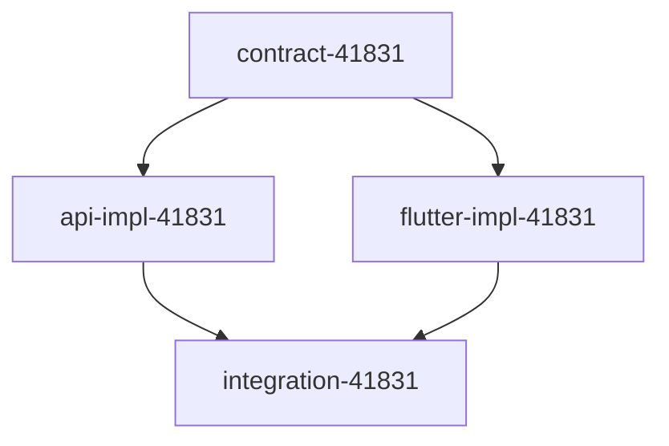

# Epic: Project Configurations

**Epic ID**: Epic-44445
**Sprint**: sprint-1
**Goal**: Create enquiry form page with API backend and Flutter frontend.

## Architecture

- **API**: NestJS module with GraphQL resolver, Mongoose schema, repository, service.
- **Flutter**: Clean Architecture feature with domain/data/presentation layers.

## Success Criteria

- User can submit enquiry form with name, email, phone, message.
- Data persisted to MongoDB via GraphQL mutation.
- Form validation on all fields.

## Tasks

| ID | Name | Phase | Depends On | Platforms |
|----|------|-------|------------|-----------|
| contract-41831 | Enquiry API Contract | 0 | — | api |
| api-impl-41831 | Enquiry API Implementation | 1 | contract-41831 | api |
| flutter-impl-41831 | Enquiry Flutter Implementation | 1 | contract-41831 | flutter |
| integration-41831 | Integration Verification | 2 | api-impl-41831, flutter-impl-41831 | api, flutter |

## Dependency Graph

## Wave Assignments

| Wave | Tasks |
|------|-------|
| 0 | contract-41831 |
| 1 | api-impl-41831, flutter-impl-41831 |
| 2 | integration-41831 |

## Effort Estimates

| Task | Optimistic | Realistic | Pessimistic |
|------|------------|-----------|-------------|
| contract-41831 | 30m | 1h | 2h |
| api-impl-41831 | 1h | 2h | 4h |
| flutter-impl-41831 | 1h | 2h | 4h |
| integration-41831 | 30m | 1h | 2h |

## Risk Assessment

- GraphQL contract changes may break Flutter if not synced.
- Form validation rules must match between API and Flutter.
