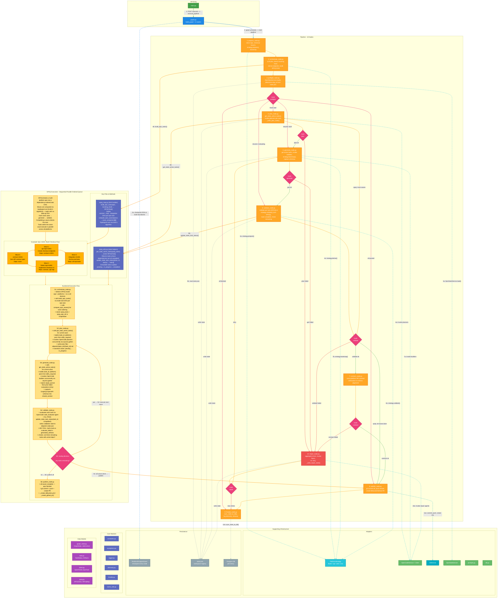

# System Component Flow

```mermaid
flowchart TB
    classDef api fill:#43a047,stroke:#2e7d32,stroke-width:2px,color:#fff
    classDef lg fill:#1e88e5,stroke:#1565c0,stroke-width:2px,color:#fff
    classDef node fill:#ffa726,stroke:#ef6c00,stroke-width:2px,color:#fff
    classDef route fill:#ec407a,stroke:#c2185b,stroke-width:2px,color:#fff
    classDef core fill:#5c6bc0,stroke:#3949ab,stroke-width:2px,color:#fff
    classDef model fill:#ab47bc,stroke:#8e24aa,stroke-width:2px,color:#fff
    classDef plat fill:#26c6da,stroke:#0097a7,stroke-width:2px,color:#fff
    classDef svc fill:#66bb6a,stroke:#388e3c,stroke-width:2px,color:#fff
    classDef git fill:#00acc1,stroke:#00838f,stroke-width:2px,color:#fff
    classDef persist fill:#90a4ae,stroke:#546e7a,stroke-width:2px,color:#fff
    classDef fail fill:#ef5350,stroke:#c62828,stroke-width:2px,color:#fff
    classDef spoqB fill:#ffb300,stroke:#e65100,stroke-width:2px,color:#000
    classDef spoqT fill:#ffe082,stroke:#ff8f00,stroke-width:2px,color:#000

    subgraph ENTRY["API Entry"]
        m["main.py"]:::api
        g["graph.py<br/>build_graph + 6 routers"]:::lg
        m -- "1: POST /execute --> execute_pipeline" --> g
    end

    subgraph PIPE["Pipeline - 10 Nodes"]
        s1["1: prepare_node.py<br/>clone repo, checkout branch,<br/>strategy.prepare(), bootstrap"]:::node
        s2["2: orchestrate_node.py<br/>LLM plan, derive mocking level,<br/>derive endpoints, build SPOQ DAG"]:::node
        s3["3: preflight_node.py<br/>EpicStateService.load(),<br/>determine skip_to from state.json"]:::node
        r1{"route<br/>preflight"}:::route
        s4["4: plan_node.py<br/>get_state_active_tasks(),<br/>invoke planners per task,<br/>_write_plan_state()"]:::node
        r2{"route<br/>plan"}:::route
        s5["5: generate_node.py<br/>get active tasks, invoke builders,<br/>strategy.bootstrap(),<br/>capture schemas"]:::node
        r3{"route<br/>generate"}:::route
        s6["6: validate_node.py<br/>validate per task (SPOQ) or<br/>strategy.validate() (non-SPOQ),<br/>mark complete, check remaining"]:::node
        r4{"route<br/>validate"}:::route
        s7["7: contract_node.py<br/>cross-platform API contract<br/>verification & schema alignment"]:::node
        r5{"route<br/>contract"}:::route
        s8["8: publish_node.py<br/>git commit all, push remote,<br/>create Bitbucket/GitHub PR"]:::node
        s9["9: finalize_node.py<br/>sync_state_to_db(),<br/>log telemetry, cleanup"]:::node
        s10["10: repair_node.py<br/>aggregate errors, invoke fixers,<br/>inc retry, _write_repair_state()"]:::fail
        r6{"route<br/>repair"}:::route

        s1 --> s2 --> s3 --> r1
        r1 -->|"fresh start"| s4
        r1 -->|"resume: built"| s5
        r1 -->|"resume: evaluating"| s6
        r1 -->|"all passed"| s8
        r1 -->|"all blocked"| s9
        s4 --> r2
        r2 -->|"plan ok"| s5
        r2 -->|"plan failed"| s10
        s5 --> r3
        r3 -->|"gen ok"| s6
        r3 -->|"gen failed"| s10
        s6 --> r4
        r4 -->|"validate ok"| s7
        r4 -->|"spoq: all waves done"| s8
        r4 -->|"spoq: more waves"| s4
        r4 -->|"validate failed"| s10
        s7 --> r5
        r5 -->|"contract ok"| s8
        r5 -->|"contract failed"| s10
        s10 --> r6
        r6 -->|"retry"| s5
        r6 -->|"max retries"| s9
        s8 --> s9
    end

    subgraph SPOQ["SPOQ Execution - Sequential Parallel Ordered Queue"]
        direction TB
        desc["SPOQ breaks a multi-platform epic into a dependency-ordered task DAG.<br/>Waves are computed via topological sort (Kahn's algorithm) — tasks with no deps go first.<br/>Each wave: plan → generate → validate. Completing a wave unlocks the next.<br/>Tasks within the same wave execute in parallel across all platforms."]:::spoqT

        subgraph FILES["Key Files & Methods"]
            sm["spoq_map.py (DAG builder)<br/>build_epic_tasks(epic, mocking_level) → SPOQTask[]<br/>  Builds contract→impl→integration DAG per epic task<br/>compute_epic_waves(epics) → wave_assignment[][]<br/>  Topological sort via Kahn's algorithm"]:::core
            su["spoq_utils.py (state helpers)<br/>get_state_active_tasks(spoq_tasks) → active SPOQTask[]<br/>  Returns tasks whose dependencies are all completed<br/>update_state_task_status(tasks, id, status) → tasks[]<br/>  Immutable status update: pending→in_progress→completed"]:::core
        end

        subgraph EX["Example: Epic-41831 'Build Checkout Flow'"]
            direction LR
            ex_ct["Wave 0<br/>contract-41831<br/>Gen API contract spec<br/>Deps: none"]:::spoqB
            ex_ai["Wave 1<br/>api-impl-41831<br/>Create checkout endpoints<br/>Deps: contract-41831"]:::spoqB
            ex_fi["Wave 1<br/>flutter-impl-41831<br/>Implement checkout UI<br/>Deps: contract, api-impl"]:::spoqB
            ex_it["Wave 2<br/>integration-41831<br/>End-to-end tests<br/>Deps: all impl tasks"]:::spoqB
            ex_ct --> ex_ai & ex_fi
            ex_ai & ex_fi --> ex_it
        end

        subgraph FLOW["Numbered Execution Flow"]
            sp1["S1: orchestrate_node.py<br/>> detects SPOQ mode: (api + platforms > 1) | LLM decision<br/>> calls build_epic_tasks() to create task DAG per epic task<br/>> calls compute_epic_waves() for wave ordering<br/>> stores spoq_tasks + spoq_epic_dir in GraphState"]:::spoqT
            sp2["S2: plan_node.py<br/>> calls get_state_active_tasks() for current wave<br/>> builds (task_id, platform) pairs from skills_required<br/>> invokes OpenCode planners concurrently via asyncio.gather<br/>> writes plan files: .ebpearls/{epic_dir}/{task_id}.md<br/>> transitions tasks: pending → in_progress"]:::spoqT
            sp3["S3: generate_node.py<br/>> calls get_state_active_tasks() for current wave<br/>> builds (task_id, platform) pairs from skills_required<br/>> invokes OpenCode builders concurrently via asyncio.gather<br/>> injects repair_journal from prior failed evaluations (retry)<br/>> captures GraphQL/OpenAPI schemas into shared_context"]:::spoqT
            sp4["S4: validate_node.py<br/>> evaluates each task via OpenCode code_evaluator agent<br/>> ALL PASS: update_state_task_status(task_id, 'completed')<br/>  writes validation state to .ebpearls state.json<br/>> ANY FAIL: marks task as evaluate_failed in generated_artifacts<br/>> checks: are there remaining tasks with unmet deps?"]:::spoqT
            wd{"S5: routing decision<br/><br/>any tasks remaining?"}:::route
            sp6["S6: publish_node.py<br/>> all waves complete — epic finished<br/>> git commit + push + create PR<br/>> _create_bitbucket_pr() / _create_github_pr()"]:::spoqT

            sp1 --> sp2 --> sp3 --> sp4 --> wd
            wd -->|"yes → S2: execute next wave"| sp2
            wd -->|"no → S6: publish all"| sp6
        end

        desc --> EX
        sm --> EX
        EX --> FLOW
        su --> FLOW
    end

    subgraph SUPPORT["Supporting Infrastructure"]
        subgraph APTR["Adapters"]
            plat["PlatformStrategy<br/>flutter / api / web / cms"]:::plat
            oc["OpenCodeService + Client"]:::svc
            git["GitService"]:::git
            es["EpicStateService"]:::svc
            prompts["prompts.py"]:::svc
            db["db.py"]:::svc
        end

        subgraph PERS["Persistence"]
            cp["ResilientPostgresSaver<br/>checkpoint every node"]:::persist
            sj["state.json<br/>workspace registry"]:::persist
            pdb["Postgres DB<br/>job history"]:::persist
        end

        subgraph CORE["Core Modules"]
            constants["constants.py"]:::core
            exceptions["exceptions.py"]:::core
            logger["logger.py"]:::core
            telemetry["telemetry.py"]:::core
            throttle["throttle.py"]:::core
            nu["name_utils.py"]:::core
        end

        subgraph MODELS["Data Models"]
            gs["graph_state.py<br/>GraphState, JobContext"]:::model
            task["task.py<br/>TaskStatus, Artifacts"]:::model
            ticket["ticket.py<br/>SprintTicket, EpicTask"]:::model
            spoq["spoq.py<br/>SPOQTask, SPOQMap"]:::model
        end
    end

    g -- "2: graph.ainvoke() --> start pipeline" --> s1
    g -.->|"2a: checkpoint R/W at node boundaries"| cp

    s1 -.->|"3a: strategy.prepare()"| plat
    s2 -.->|"4a: strategy.derive()"| plat
    s2 -->|"4b: build_epic_tasks()"| sm
    s3 -.->|"5a: EpicStateService.load()"| es
    s3 -.->|"5b: read state.json"| sj
    s4 -.->|"6a: invoke planners"| oc
    s4 -->|"6b: get_state_active_tasks()"| su
    s5 -.->|"7a: invoke builders"| oc
    s5 -.->|"7b: strategy.bootstrap()"| plat
    s6 -.->|"8a: strategy.validate()"| plat
    s6 -->|"8b: update_state_task_status()"| su
    wd -->|"8c: all waves done → publish"| s8
    s10 -.->|"10a: invoke repair agents"| oc
    s8 -.->|"11a: commit, push, create PR"| git
    s9 -.->|"12a: sync_state_to_db()"| pdb
    s4 -.->|"write state"| sj
    s5 -.->|"write state"| sj
    s6 -.->|"write state"| sj
    s10 -.->|"write state"| sj

    linkStyle 0 stroke:#43a047,stroke-width:2px
    linkStyle 41,42 stroke:#1e88e5,stroke-width:2px
    linkStyle 1,2,3,9,12,15,18,20,23,24,26 stroke:#ffa726,stroke-width:2px
    linkStyle 4,5,6,7,8 stroke:#ec407a,stroke-width:2px
    linkStyle 10,13,16,17,21 stroke:#66bb6a,stroke-width:2px
    linkStyle 11,14,19,22,25 stroke:#ef5350,stroke-width:2px
    linkStyle 27,28,29,30,31,32,33,34,35,36,37,38,39,40,45,49,53,54 stroke:#ff8f00,stroke-width:2px
    linkStyle 43,44,46,48,50,51,52,55 stroke:#26c6da,stroke-width:2px
    linkStyle 56 stroke:#00acc1,stroke-width:2px
    linkStyle 47,57,58,59,60,61 stroke:#90a4ae,stroke-dasharray:5 5,stroke-width:2px
```
