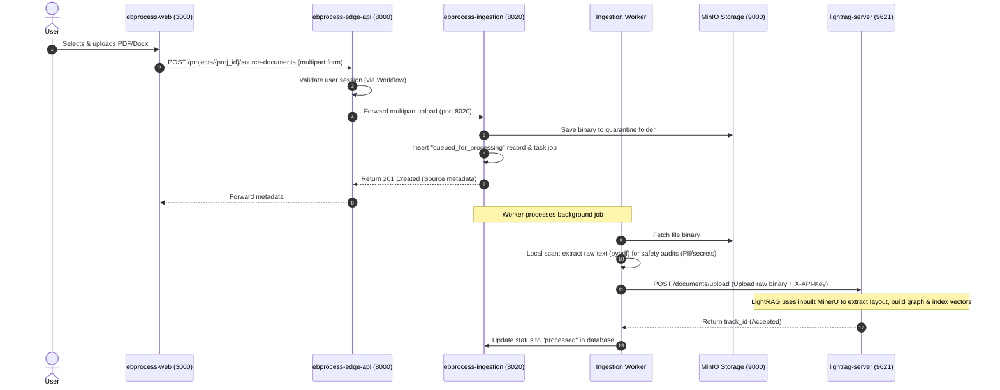

# EBProcess & LightRAG Connectivity and Integration Guide

This guide explains how to connect and orchestrate the following services for local development and production:
- **`ebprocess-web`**: Next.js React frontend (Port `3000`)
- **`ebprocess-edge-api`**: FastAPI API Gateway & BFF (Port `8000`)
- **`ebprocess-ingestion`**: FastAPI Document Ingestion API & Worker (Port `8020` / Background worker)
- **`lightrag-server`**: Standalone LightRAG Graph & Vector database (Port `9621`)

---

## 1. Architectural Recommendations

### Why Use the Inbuilt MinerU Parser?
MinerU is a high-precision, layout-aware PDF parser that extracts clean Markdown while preserving structures like tables, lists, headers, and footnotes. Because MinerU relies on deep learning models (PyTorch, layout analysis, OCR, etc.), a standalone MinerU container is resource-heavy (~10-15GB image, high memory and CPU usage).

To minimize local development overhead on your Mac Mini, **we recommend utilizing the inbuilt MinerU parser packaged directly inside `lightrag-server`**.

### Recommended End-to-End Flow



---

## 2. Step 1: Shared Docker Network Setup

To allow container-to-container communication between the `ebprocess-platform` compose network and the `lightrag-server` network:

1. **LightRAG Compose Configuration** (`lightrag-server/docker-compose.yml`):
   Ensure that the default network is named `lightrag-shared` and is bridged.
   ```yaml
   # lightrag-server/docker-compose.yml
   networks:
     default:
       name: lightrag-shared
   ```

2. **EBProcess Platform Compose Configuration** (`ebprocess-platform/docker-compose.yml`):
   Connect your main platform containers to the external `lightrag-shared` network so they can resolve the hostname `lightrag` (or `lightrag-api` depending on container name).
   
   Add the network declaration at the bottom of the platform compose file:
   ```yaml
   # Add this to the bottom of ebprocess-platform/docker-compose.yml
   networks:
     default:
       name: lightrag-shared
       external: true
   ```
   
   Now, any service in `ebprocess-platform` can reach the LightRAG server using the internal Docker DNS host:
   `http://lightrag:9621` (or `http://lightrag:8080` if using the proxy profile).

---

## 3. Step 2: Configure and Update `ebprocess-ingestion`

The ingestion worker must download the binary from MinIO, perform its quick local scan (for malware, secrets, and PII), and then forward the raw file binary to the LightRAG server.

### A. Environment Configuration (`ebprocess-ingestion/.env`)
Add the following keys to your ingestion environment:
```bash
# Add to ebprocess-ingestion/.env
LIGHTRAG_API_BASE_URL=http://lightrag:9621
LIGHTRAG_API_KEY=rH8Q1J6mWKNS1sREkzp3b2Yh79FpHjhA
```

### B. Ingestion Worker Hook (`app/ingestion_worker.py`)
Modify the `_complete_processing` function in `app/ingestion_worker.py` to forward clean documents to `lightrag-server`.

```python
# Import httpx at the top of app/ingestion_worker.py
import httpx

# Modify _complete_processing to forward the file binary to LightRAG
def _complete_processing(self, job: DocumentJob, safe_text: str, findings: list[dict[str, Any]]) -> str:
    with self.uow_factory() as uow:
        doc = uow.sources.get(str(job.source_document_id))
        if doc.status in {"deleted", "purged"}:
            uow.document_jobs.mark_succeeded(job.id, worker_id=self.worker_id)
            uow.commit()
            return "skipped"
        
        # 1. Block quarantine path
        has_blocker = any(item.get("severity") == "non_waivable_block" for item in findings)
        if has_blocker:
            doc.status = "quarantined"
            doc.last_processing_error = None
            doc.processing_failed_at = None
            uow.sources.update(doc, expected_row_version=doc.row_version)
            self._add_scan_audit(uow, doc, scan, job, findings)
            self._add_outbox(uow, doc, "source.quarantined", {"sourceDocumentId": doc.id}, dedupe_key=f"source.quarantined:{doc.id}:{job.id}")
            uow.document_jobs.mark_succeeded(job.id, worker_id=self.worker_id)
            uow.commit()
            return "quarantined"

        # 2. Forward clean document to LightRAG Server (Inbuilt MinerU Parser)
        lightrag_url = os.getenv("LIGHTRAG_API_BASE_URL")
        lightrag_key = os.getenv("LIGHTRAG_API_KEY")
        
        if lightrag_url and lightrag_key:
            try:
                # Fetch raw file binary from MinIO
                file_bytes = self.storage.get_bytes(doc.object_key)
                
                # Send binary to /documents/upload
                headers = {"X-API-Key": lightrag_key}
                files = {"file": (doc.filename, file_bytes, doc.content_type or "application/octet-stream")}
                
                # We can also pass workspace context using a query parameter or custom header if configured
                response = httpx.post(
                    f"{lightrag_url.rstrip('/')}/documents/upload",
                    headers=headers,
                    files=files,
                    timeout=180.0 # Heavy layout parsing can take up to 3 mins
                )
                response.raise_for_status()
                logger.info(f"Successfully uploaded {doc.filename} to LightRAG. Server response: {response.json()}")
            except Exception as e:
                logger.error(f"Failed to forward document {doc.filename} to LightRAG: {e}")
                # For local development, you may decide whether to fail the whole job, 
                # or log the error and proceed.

        # 3. Standard Ingestion complete flow
        run = SourceDocumentProcessingRun(
            id=new_id("proc"),
            workspace_id=doc.workspace_id,
            project_id=doc.project_id,
            source_document_id=doc.id,
            source_document_scan_id=scan.id,
            status="available_to_agent",
            safe_text_hash=text_hash(safe_text),
            safe_text=safe_text
        )
        uow.source_lifecycle.add_processing_run(run)
        doc.current_processing_run_id = run.id
        doc.status = "processed"
        uow.sources.update(doc, expected_row_version=doc.row_version)
        
        # Save excerpt chunks references and trigger outbox
        ...
```

---

## 4. Step 3: Configure and Update `ebprocess-edge-api`

The edge API gateway acts as the secure entry point for frontend clients. It will expose a `/query` router that proxies requests to the internal `lightrag-server`.

### A. Environment Configuration (`ebprocess-edge-api/.env`)
Add LightRAG credentials to the edge configuration:
```bash
# Add to ebprocess-edge-api/.env
LIGHTRAG_API_BASE_URL=http://lightrag:9621
LIGHTRAG_API_KEY=rH8Q1J6mWKNS1sREkzp3b2Yh79FpHjhA
```

### B. Gateway Routing Code (`app/edge_proxy_main.py`)
Modify `app/edge_proxy_main.py` to route RAG query requests.

1. **Add Route Patterns**:
   Define paths that route to LightRAG:
   ```python
   # Add to app/edge_proxy_main.py imports & globals
   LIGHTRAG_PATTERNS = [
       re.compile(r"^/projects/[^/]+/rag-query$"),
       re.compile(r"^/projects/[^/]+/rag-chat$"),
   ]
   ```

2. **Update target routing**:
   Update `_target_service` and `_base_url` to recognize the `"lightrag"` target service:
   ```python
   def _target_service(path: str) -> str:
       if any(pattern.match(path) for pattern in INGESTION_PATTERNS):
           return "ingestion"
       if any(pattern.match(path) for pattern in GOVERNANCE_PATTERNS):
           return "artifact_governance"
       if any(pattern.match(path) for pattern in LEARNING_PATTERNS):
           return "learning"
       if any(pattern.match(path) for pattern in LIGHTRAG_PATTERNS):
           return "lightrag"
       return "workflow"

   def _base_url(service: str) -> str:
       env_by_service = {
           "workflow": "WORKFLOW_API_BASE_URL",
           "ingestion": "INGESTION_API_BASE_URL",
           "artifact_governance": "ARTIFACT_GOVERNANCE_API_BASE_URL",
           "learning": "LEARNING_API_BASE_URL",
           "lightrag": "LIGHTRAG_API_BASE_URL",
       }
       return os.getenv(env_by_service[service], "").rstrip("/")
   ```

3. **Incorporate Multi-Tenancy & Authorization in Proxy**:
   In the main `proxy` routing endpoint:
   - Extract the project identifier from the path (e.g., `projectId`).
   - Validate project memberships and access (the edge API does this automatically by calling the workflow service `/me` endpoint).
   - Inject the LightRAG authorization token (`X-API-Key` header).
   - (Optional) Implement multi-tenancy isolation by sending workspace details in the headers or matching paths if configured on LightRAG server.

   ```python
   # In app/edge_proxy_main.py proxy() method:
   @app.api_route("/{path:path}", methods=["GET", "POST", "PUT", "PATCH", "DELETE", "OPTIONS"])
   async def proxy(path: str, request: Request) -> Response:
       request_path = "/" + path
       if request_path.startswith(BLOCKED_BROWSER_PREFIXES):
           raise HTTPException(404, "Not found")
       
       _require_csrf_for_browser_write(request, request_path)
       target_service = _target_service(request_path)
       base_url = _base_url(target_service)
       if not base_url:
           raise HTTPException(503, f"{target_service} upstream is not configured")
       
       body = await request.body()
       headers = _forward_headers(request)
       
       # Fetch user session info for downstream auth context
       async with httpx.AsyncClient(timeout=float(os.getenv("EDGE_PROXY_TIMEOUT_SECONDS", "30")), follow_redirects=False) as client:
           if target_service != "workflow":
               headers.update(await _identity_headers(client, request))
           
           # If forwarding to LightRAG, swap browser authentication with service API Key
           if target_service == "lightrag":
               headers["X-API-Key"] = os.getenv("LIGHTRAG_API_KEY", "")
               headers["Content-Type"] = "application/json"
               
               # Rewrite the request path to match lightrag API structure:
               # e.g., POST /projects/{proj_id}/rag-query -> POST /query
               if "rag-query" in request_path:
                   target_url = f"{base_url}/query"
               elif "rag-chat" in request_path:
                   target_url = f"{base_url}/api/chat"
               else:
                   target_url = f"{base_url}/{path}"
           else:
               target_url = f"{base_url}/{path}"
               
           upstream = await client.request(
               request.method,
               target_url,
               params=request.query_params,
               content=body,
               headers=headers
           )
           
       response = Response(
           content=upstream.content,
           status_code=upstream.status_code,
           headers=_response_headers(upstream),
           media_type=upstream.headers.get("content-type"),
       )
       return response
   ```

---

## 5. Step 4: Frontend Client Usage Examples

Once connected, your React Next.js components in `ebprocess-web` can perform queries against the edge gateway.

### Call RAG Query API (from Next.js)
```typescript
import { api } from '@/lib/api';

interface RagQueryRequest {
  query: string;
  mode: 'hybrid' | 'local' | 'global' | 'naive' | 'mix';
  include_references?: boolean;
}

interface RagQueryResponse {
  response: string;
  references?: any[];
}

export async function askLightRag(projectId: string, question: string) {
  const payload: RagQueryRequest = {
    query: question,
    mode: 'hybrid',
    include_references: true,
  };
  
  // This gets routed to: http://localhost:8000/projects/{projectId}/rag-query 
  // and proxied directly to: http://lightrag:9621/query
  const data = await api<RagQueryResponse>(`/projects/${projectId}/rag-query`, {
    method: 'POST',
    body: JSON.stringify(payload),
  });
  
  return data;
}
```

---

## 6. Verification & Monitoring

1. **Verify Ingestion to LightRAG**:
   Run the following query against the LightRAG server to verify if documents are indexing successfully:
   ```bash
   curl -s http://localhost:9621/documents/pipeline_status -H "X-API-Key: rH8Q1J6mWKNS1sREkzp3b2Yh79FpHjhA"
   ```

2. **Verify Port & DNS resolution**:
   Enter the `ebprocess-ingestion` or `ebprocess-edge-api` container shell and curl the health check of the LightRAG container:
   ```bash
   curl http://lightrag:9621/health
   ```
